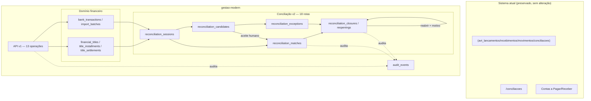
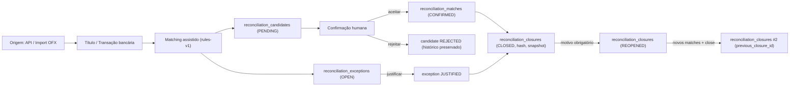

# Finalização do projeto — `gestao-modern`

**Data:** 14/08/2026
**Responsável técnico desta finalização:** execução única, sem divisão de trabalho com Codex, conforme instrução recebida.

## Classificação final honesta

```text
B — FUNCIONALMENTE COMPLETO, AGUARDANDO HOMOLOGAÇÃO/PRODUÇÃO
```

Não é `A` porque a homologação MariaDB 10.1 (concorrência real) não foi comprovada e as pendências de negócio da Fase 6 não foram respondidas — ambos pré-requisitos inegociáveis para `PRODUCTION READY` (ver `PRE_PRODUCTION_READINESS_FINAL.md`). Não é `C` porque nenhum bug funcional foi encontrado na auditoria desta finalização (`AUDITORIA_FINAL_PROJETO.md`) e a suíte de regressão local está 100% verde.

## Objetivo do sistema

Substituir gradualmente, ao lado do legado (nunca removendo-o sem decisão formal), o fluxo de conciliação bancária manual e pouco auditável por um núcleo com:

- fatos financeiros e bancários explicitamente separados de decisões de conciliação (`título ≠ liquidação ≠ transação bancária ≠ conciliação ≠ fechamento`, conforme `Documento_Fonte_Conciliação_Acop.docx`);
- API-first, idempotente, com auditoria completa;
- conciliação manual persistente, matching assistido (nunca automático) e fechamento reproduzível e auditável.

## Estado das Fases 1–6

| Fase | Escopo | Estado |
|---|---|---|
| 1 | Núcleo financeiro (`financial_titles`, parcelas, liquidações, auditoria) | Implementado |
| 2 | API v1 machine-to-machine (Bearer, scopes, idempotência) | Implementado, 13 operações |
| 3 | Importação bancária/OFX, deduplicação por identidade forte | Implementado |
| 4 | Conciliação manual persistente (1:1/1:N/N:1/N:N, void) | Implementado |
| 5 | Matching assistido (candidatos, score, divergências) — sempre com decisão humana | Implementado |
| 6 | Fechamento e governança (snapshot, hash, reabertura) | Implementado (desenvolvimento); homologação pendente |

## Arquitetura final



Nenhuma seta cruza de `Novo` para `Legado` ou vice-versa além da referência de leitura em `contas` (cadastro compartilhado, sem FK).

## Fluxo ponta a ponta



## Testes

111 testes / 652 asserções (SQLite), 0 falhas, verificado nesta finalização. Distribuição aproximada: núcleo financeiro e API v1 (Fases 1–2), importação/dedupe OFX (Fase 3), conciliação manual (Fase 4), matching/candidatos/exceptions (Fase 5), fechamento/reabertura/hash/RBAC/flags (Fase 6, 18 testes dedicados).

## Segurança

Auditoria pontual desta finalização (`AUDITORIA_FINAL_PROJETO.md`): CSRF ativo em todas as rotas web, mass assignment protegido por `$fillable`/`validate()` explícito, IDOR mitigado por escopo `source_system_id` na API v1, XXE mitigado por rejeição explícita de DOCTYPE/ENTITY no parser OFX (que nem usa parser XML real), sem raw SQL com entrada de usuário, sem segredo commitado. Nenhum SAST dedicado foi executado — recomendado antes de produção real.

## Feature flags

```dotenv
RECONCILIATION_V2_ENABLED=false
RECONCILIATION_MATCHING_ENABLED=false
RECONCILIATION_CLOSING_ENABLED=false
```

Todas `false` por padrão. `closing` depende de `v2`, independente de `matching` — matriz testada explicitamente.

## Conciliação, matching, closing e reopening

Ver `IMPLEMENTACAO_FASE_4.md`, `IMPLEMENTACAO_FASE_5.md`, `IMPLEMENTACAO_FASE_6.md`. Resumo: nenhuma baixa automática, nenhum auto-match, fechamento sempre atômico com hash SHA-256 determinístico sobre snapshot canônico, reabertura sempre excepcional e auditada, histórico nunca apagado.

## Auditoria

`audit_events` (moderno) cobre toda ação relevante de Fases 1–6 com `before_state`/`after_state`, ator e `correlation_id`. Sistema de auditoria legado (`App\Services\Audit`) continua paralelo e intocado.

## MariaDB

Ver `HOMOLOGACAO_MARIADB_FINAL.md`. Status: **BLOCKED EXTERNALLY** — Docker instalado nesta máquina, mas daemon não ativo; nenhuma ação de infraestrutura foi tomada automaticamente.

## Negócio

Ver `PENDENCIAS_NEGOCIO_FINAIS.md`. 14 perguntas da Fase 6 sem resposta formal; defaults seguros documentados em ADR-015 em uso.

## Produção

**NÃO AUTORIZADA.** Ver `PRE_PRODUCTION_READINESS_FINAL.md` para o gate completo.

## Pendências

Ver `PENDENCIAS_FINAIS_PROJETO.md` (matriz completa) e `PENDENCIAS_NEGOCIO_FINAIS.md` (pendências de negócio detalhadas).

## Próximas ações

1. Um humano com acesso à máquina inicia o Docker Desktop e roda `tools/homologation/run-mariadb-homologation.ps1 -StartManagedContainer` — desbloqueia toda a homologação técnica de uma vez (Fases 1–6, schema + concorrência + performance).
2. Levar `PENDENCIAS_NEGOCIO_FINAIS.md`/`CHECKLIST_HOMOLOGACAO_FINANCEIRO.md` ao time financeiro.
3. Com as duas frentes concluídas, seguir o gate de `PRE_PRODUCTION_READINESS_FINAL.md` e a ativação gradual de `PLANO_OPERACAO_PARALELA.md`.
4. Não iniciar uma "Fase 7" de novas funcionalidades antes de concluir 1–3 — o núcleo está funcionalmente completo para o escopo definido pelo `Documento_Fonte_Conciliação_Acop.docx`.
