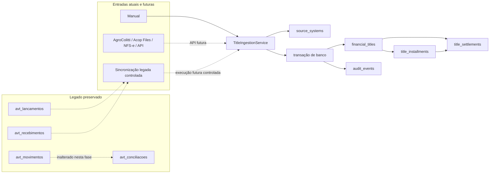

# IMPLEMENTAÇÃO — FASE 1 DO NOVO NÚCLEO FINANCEIRO ACOP

**Data:** 13/08/2026  
**Projeto:** `gestao-modern`  
**Estratégia:** evolução aditiva, com coexistência do legado  
**Banco-alvo auditado:** MariaDB 10.1.10, prefixo `avt_`

## 1. O que foi implementado

- baseline seguro de migrations, sem as migrations padrão incompatíveis de `users`, `cache` e `jobs`;
- catálogo extensível de sistemas de origem com oito códigos iniciais;
- modelo canônico único de título para `PAYABLE` e `RECEIVABLE`;
- vínculo opcional e não identitário com o legado por `legacy_type + legacy_id`;
- valores novos em `DECIMAL(15,2)` e cálculos de aplicação em centavos inteiros;
- parcelas com identidade, número, vencimento, valor, estado e soma exata;
- calendário mensal com dia âncora e regra explícita de fim de mês;
- liquidações separadas, integrais ou parciais, associadas ao título/parcela;
- saldo remanescente derivado das liquidações confirmadas;
- ingestão transacional com decisões de criar, atualizar, ignorar e rejeitar;
- idempotência por origem + identificador externo e origem + chave de requisição;
- auditoria aditiva com ator, ação, entidade, before/after, origem, correlação e data;
- rollback atômico de título + parcelas + auditoria e de liquidação + estados + auditoria;
- models e relacionamentos Eloquent do novo núcleo;
- testes de domínio, integração, schema e compatibilidade básica;
- três ADRs e runbook operacional de migrations.

Nenhum controller, rota ou tela legado foi convertido para o núcleo novo. Nenhum histórico foi copiado automaticamente.

## 2. Nova arquitetura



Fluxo interno:

```text
HTTP/API futura
    -> Request/Controller futuro
        -> TitleIngestionService / SettlementService
            -> regras de domínio e Money
                -> Eloquent + transação + audit_event
```

## 3. Novas tabelas

Os nomes físicos recebem o prefixo configurado; no banco auditado são `avt_source_systems`, `avt_financial_titles`, `avt_title_installments`, `avt_title_settlements` e `avt_audit_events`.

### 3.1 `source_systems`

**Objetivo:** catálogo extensível de origens internas, legadas, integrações e futuras importações bancárias.

| Campo | Tipo | Regra |
|---|---|---|
| `id` | BIGINT unsigned | PK, auto incremento |
| `code` | VARCHAR(64) | obrigatório, único |
| `name` | VARCHAR(120) | obrigatório |
| `type` | VARCHAR(40) | default `INTEGRATION` |
| `active` | BOOLEAN | default verdadeiro |
| `configuration` | LONGTEXT | JSON opcional via cast, sem depender de JSON do MariaDB antigo |
| `created_at`, `updated_at` | TIMESTAMP nullable | timestamps Laravel |

- **PK:** `id`.
- **FKs:** nenhuma.
- **Índices/constraints:** unique de `code`.
- **Carga inicial:** `MANUAL`, `LEGACY_PAYABLE`, `LEGACY_RECEIVABLE`, `AGROCOLITTI`, `ACOP_FILES`, `NFSE`, `BANK_IMPORT`, `API`.

### 3.2 `financial_titles`

**Objetivo:** identidade canônica da obrigação ou do direito financeiro.

| Campo | Tipo | Regra |
|---|---|---|
| `id` | BIGINT unsigned | PK |
| `type` | VARCHAR(20) | `PAYABLE` ou `RECEIVABLE` no domínio |
| `source_system_id` | BIGINT unsigned | origem obrigatória |
| `external_id` | VARCHAR(128) nullable | identidade dentro da origem |
| `idempotency_key` | VARCHAR(128) nullable | primeira chave de requisição reservada |
| `payload_hash` | CHAR(64) | SHA-256 do conteúdo normalizado |
| `party_type` | VARCHAR(30) nullable | tipo lógico da contraparte |
| `party_id` | INT unsigned nullable | referência compatível com cadastro atual |
| `party_name` | VARCHAR(191) nullable | snapshot/nome quando aplicável |
| `document_number` | VARCHAR(120) nullable | documento de negócio |
| `issue_date`, `due_date` | DATE | emissão e vencimento |
| `original_amount` | DECIMAL(15,2) | valor original |
| `discount_amount` | DECIMAL(15,2) | default zero |
| `addition_amount` | DECIMAL(15,2) | default zero |
| `total_amount` | DECIMAL(15,2) | original - desconto + acréscimo |
| `currency` | CHAR(3) | default `BRL`, código ISO no serviço |
| `account_id` | INT unsigned nullable | referência de classificação atual |
| `category_id` | INT unsigned nullable | referência de classificação atual |
| `cost_center_id` | INT unsigned nullable | referência de classificação atual |
| `status` | VARCHAR(30) | `OPEN`, `PARTIALLY_SETTLED`, `SETTLED`, `CANCELLED` |
| `notes` | TEXT nullable | observações |
| `legacy_type` | VARCHAR(30) nullable | tipo da ponte legada |
| `legacy_id` | INT unsigned nullable | ID legado, não é identidade canônica |
| timestamps + `deleted_at` | TIMESTAMP nullable | criação, alteração e exclusão lógica |

- **PK:** `id`.
- **FK:** `source_system_id -> source_systems.id`, `ON DELETE RESTRICT`.
- **Unique:** `(source_system_id, external_id)`; `(source_system_id, idempotency_key)`; `(legacy_type, legacy_id)`.
- **Índices:** `(type, status, due_date)`; `(party_type, party_id)`; `account_id`.
- **Validação adicional:** origem externa exige `external_id`; ponte legada exige tipo e ID juntos; chaves vazias viram `NULL`.

### 3.3 `title_installments`

**Objetivo:** representar cada parcela com identidade e saldo próprios.

| Campo | Tipo | Regra |
|---|---|---|
| `id` | BIGINT unsigned | PK |
| `financial_title_id` | BIGINT unsigned | título obrigatório |
| `installment_number` | INT unsigned | sequência a partir de 1 |
| `due_date` | DATE | vencimento individual |
| `amount` | DECIMAL(15,2) | valor individual |
| `status` | VARCHAR(30) | default `OPEN` |
| `created_at`, `updated_at` | TIMESTAMP nullable | timestamps |

- **PK:** `id`.
- **FK:** `financial_title_id -> financial_titles.id`, `ON DELETE RESTRICT`.
- **Unique:** `(financial_title_id, installment_number)`.
- **Índice:** `(status, due_date)`.

### 3.4 `title_settlements`

**Objetivo:** fato financeiro de pagamento/recebimento separado da obrigação original.

| Campo | Tipo | Regra |
|---|---|---|
| `id` | BIGINT unsigned | PK |
| `financial_title_id` | BIGINT unsigned | título obrigatório |
| `title_installment_id` | BIGINT unsigned nullable | parcela liquidada |
| `settlement_date` | DATE | data do evento |
| `amount` | DECIMAL(15,2) | valor positivo do evento |
| `type` | VARCHAR(20) | `PAYMENT`, `RECEIPT`, previsão de `REVERSAL` |
| `status` | VARCHAR(20) | default `CONFIRMED`; previsão de `CANCELLED` |
| `source_system_id` | BIGINT unsigned nullable | origem do evento |
| `external_id` | VARCHAR(128) nullable | ID do evento na origem |
| `idempotency_key` | VARCHAR(128) nullable | chave de requisição |
| `payload_hash` | CHAR(64) nullable | conteúdo normalizado do evento |
| `created_by` | INT unsigned nullable | ator legado/atual |
| `correlation_id` | VARCHAR(64) nullable | UUID de rastreamento |
| `metadata` | LONGTEXT nullable | metadados via cast JSON |
| `created_at`, `updated_at` | TIMESTAMP nullable | timestamps |

- **PK:** `id`.
- **FKs:** título, parcela e origem, todas `ON DELETE RESTRICT`.
- **Unique:** `(source_system_id, external_id)` e `(source_system_id, idempotency_key)`.
- **Índices:** `(financial_title_id, status, settlement_date)` e `title_installment_id`.
- **Validação adicional:** chave externa exige origem ativa; liquidação não pode exceder o saldo; título cancelado é rejeitado; título com várias parcelas exige a parcela.

### 3.5 `audit_events`

**Objetivo:** trilha aditiva e rica para as operações do núcleo novo.

| Campo | Tipo | Regra |
|---|---|---|
| `id` | BIGINT unsigned | PK |
| `actor_id` | INT unsigned nullable | usuário/ator |
| `action` | VARCHAR(80) | ação semântica |
| `entity_type` | VARCHAR(100) | classe/tipo da entidade |
| `entity_id` | VARCHAR(64) | ID serializado |
| `before_state`, `after_state` | LONGTEXT nullable | JSON via cast |
| `source_system_id` | BIGINT unsigned nullable | origem |
| `correlation_id` | VARCHAR(64) nullable | correlação |
| `occurred_at` | TIMESTAMP | instante do evento |
| `created_at`, `updated_at` | TIMESTAMP nullable | timestamps técnicos |

- **PK:** `id`.
- **FK:** `source_system_id -> source_systems.id`, `ON DELETE RESTRICT`.
- **Índices:** `(entity_type, entity_id)`, `(actor_id, occurred_at)`, `correlation_id`.

## 4. Compatibilidade com o legado

- `avt_lancamentos`, `avt_recebimentos`, `avt_movimentos` e `avt_conciliacoes` não foram removidas, renomeadas ou alteradas.
- As telas atuais continuam lendo e gravando pelos models `Lancamento`, `Recebimento`, `Movimento` e `Conciliacao`.
- O núcleo novo não foi conectado às telas nem aos relatórios, evitando dupla escrita silenciosa.
- `legacy_type + legacy_id` funciona somente como ponte rastreável e única; o `financial_titles.id` continua sendo a identidade do domínio.
- A futura sincronização deverá ler o legado em lote controlado e chamar `TitleIngestionService` com `LEGACY_PAYABLE` ou `LEGACY_RECEIVABLE`.
- Nenhum dado histórico foi convertido nesta fase.

## 5. Idempotência

1. O serviço resolve a origem ativa pelo código normalizado e bloqueia sua linha durante a decisão transacional.
2. Para origens diferentes de `MANUAL`, `external_id` é obrigatório.
3. Strings vazias são normalizadas para `NULL`, evitando que `''` se torne uma identidade compartilhada acidental.
4. O payload é normalizado; valores viram strings de duas casas, datas viram `YYYY-MM-DD` e o hash inclui a quantidade de parcelas.
5. A `Idempotency-Key` não entra no hash, pois não muda o conteúdo financeiro.
6. O serviço procura por origem + chave, origem + `external_id` e, quando aplicável, ponte legada.
7. Mesmo conteúdo retorna `IGNORED` e o mesmo título.
8. Mesma `Idempotency-Key` com conteúdo diferente é rejeitada.
9. Mesmo `external_id` com conteúdo diferente atualiza somente título ainda sem liquidações e não cancelado.
10. Se chaves diferentes apontarem para títulos diferentes, a requisição é rejeitada.
11. Constraints únicas garantem a regra no banco. O mesmo `external_id` em duas origens é permitido.

A primeira chave associada ao título não é substituída. Uma tabela genérica de histórico/replay de todas as chaves HTTP ficará para a implementação da API, sem impedir que a futura camada HTTP repasse a chave atual ao serviço.

## 6. Parcelas

O valor total é convertido para centavos inteiros. Para `R$ 100,00 / 3`:

```text
10000 centavos / 3
parcela 1 = 3333
parcela 2 = 3333
parcela 3 = 3334
total      = 10000
```

O resíduo é atribuído à última parcela; não há perda nem criação de centavos. Uma parcela também é materializada quando a quantidade é 1, garantindo identidade uniforme.

Datas usam o mês-base, o dia âncora e o último dia disponível. Se o primeiro vencimento for o último dia do mês, todas as parcelas seguintes vencem no último dia de seus meses: `31/01 -> 28/02 -> 31/03`. Para um dia que não seja fim de mês, preserva-se o dia quando ele existir e usa-se o último dia apenas nos meses menores.

## 7. Liquidações

- O serviço infere `PAYMENT` para título `PAYABLE` e `RECEIPT` para `RECEIVABLE`.
- Cada evento possui data, valor, tipo, estado, origem, chaves externas, ator e correlação próprios.
- O saldo é `total_amount - soma das liquidações CONFIRMED`; o modelo já considera `REVERSAL` com sinal inverso, mas o comando de estorno não foi implementado.
- `R$ 1.000,00` com liquidação de `R$ 400,00` fica `PARTIALLY_SETTLED` e com saldo `R$ 600,00`; outra de `R$ 600,00` fecha o título.
- Título de uma parcela associa o evento automaticamente. Título com várias parcelas exige `title_installment_id`, mantendo estados e saldos coerentes por parcela.
- Reenvio idêntico de liquidação retorna a mesma linha, inclusive depois que o título já estiver fechado.
- Falha na auditoria reverte criação da liquidação e alterações de estado.

## 8. Testes

**Resultado final:** 30 testes e 111 asserções aprovados, sem uso de dados de produção.

Cobertura principal:

- criação `PAYABLE` e `RECEIVABLE`, estado inicial e fórmula monetária;
- external ID obrigatório em origem externa e nulo seguro em `MANUAL`;
- idempotência, chave com payload divergente, reenvio com outra chave e origens diferentes;
- atualização controlada e bloqueio após qualquer liquidação;
- ponte legada válida somente com tipo + ID;
- 1, 2 e 3 parcelas, soma exata, arredondamento e dia 31;
- liquidação integral, parcial, duas liquidações e saldo;
- liquidação de múltiplas parcelas e reenvio idempotente;
- rollback de ingestão e de liquidação quando a auditoria falha;
- presença das tabelas aditivas, ausência de tabelas padrão/legadas em schema limpo e tipos decimais;
- catálogo inicial de origens;
- login público, redirects e proteção dos módulos atuais.

O PHPUnit usa SQLite `:memory:`, `RefreshDatabase`, cache/sessão em memória e não acessa o banco real.

## 9. Migrations

### Baseline

Foram retiradas do conjunto migrável, sem inserir linhas artificiais em `avt_migrations`:

- `0001_01_01_000000_create_users_table.php`;
- `0001_01_01_000001_create_cache_table.php`;
- `0001_01_01_000002_create_jobs_table.php`.

Elas nunca tinham sido executadas no banco auditado; `create_users` tentaria recriar `avt_users` com outro schema.

### Criadas para o núcleo

- `2026_08_13_000010_create_source_systems_table.php`;
- `2026_08_13_000020_create_financial_titles_table.php`;
- `2026_08_13_000030_create_title_installments_table.php`;
- `2026_08_13_000040_create_title_settlements_table.php`;
- `2026_08_13_000050_create_audit_events_table.php`.

`2026_08_12_000001_create_documentos_modernos_table.php` já existia e estava marcada como executada no banco auditado.

### Estado verificado

- No repositório, `migrate:status` não lista mais as três migrations perigosas.
- Em banco SQLite temporário isolado com `DB_PREFIX=avt_`, foram aprovados: `migrate --pretend`, `migrate`, `migrate:status`, rollback completo, segundo `migrate` e estado final com as seis migrations em `[1] Ran`.
- A validação desta entrega não executou migration no banco real. O deploy deve seguir `docs/operations/PHASE-1-MIGRATION-RUNBOOK.md`.

## 10. Arquivos alterados

### Aplicação e domínio

- `app/Application/Financial/InstallmentScheduleService.php`
- `app/Application/Financial/SettlementService.php`
- `app/Application/Financial/TitleIngestionService.php`
- `app/Contracts/AuditEventRecorder.php`
- `app/Domain/Financial/Enums/FinancialTitleType.php`
- `app/Domain/Financial/Enums/IngestionDecision.php`
- `app/Domain/Financial/Enums/SettlementStatus.php`
- `app/Domain/Financial/Enums/SettlementType.php`
- `app/Domain/Financial/Enums/TitleStatus.php`
- `app/Domain/Financial/IngestionResult.php`
- `app/Domain/Financial/Money.php`
- `app/Domain/Financial/TitleIngestionData.php`
- `app/Infrastructure/Audit/DatabaseAuditEventRecorder.php`
- `app/Models/AuditEvent.php`
- `app/Models/FinancialTitle.php`
- `app/Models/SourceSystem.php`
- `app/Models/TitleInstallment.php`
- `app/Models/TitleSettlement.php`
- `app/Providers/AppServiceProvider.php`
- `config/database.php`

### Migrations

- as cinco migrations `2026_08_13_000010` a `000050` listadas acima;
- remoção das três migrations padrão incompatíveis listadas na seção 9.

### Testes

- `tests/Feature/FinancialCoreTest.php`
- `tests/Feature/MigrationSafetyTest.php`
- `tests/Unit/InstallmentScheduleServiceTest.php`

### Documentação

- `docs/architecture/ADR-001-financial-title-model.md`
- `docs/architecture/ADR-002-source-and-idempotency.md`
- `docs/architecture/ADR-003-legacy-coexistence.md`
- `docs/operations/PHASE-1-MIGRATION-RUNBOOK.md`
- `IMPLEMENTACAO_FASE_1.md`

## 11. Problemas encontrados

1. O repositório Git raiz não possui arquivos rastreados; todo o workspace já aparecia como `untracked` no início. Por isso `git diff --stat` não representa os arquivos novos, embora `git status` os liste.
2. As migrations padrão do Laravel estavam pendentes e incompatíveis com `avt_users`.
3. O banco alvo é MariaDB 10.1.10. Foi necessário limitar chaves indexadas, usar `LONGTEXT` para JSON e fixar InnoDB; não há instância MariaDB 10.1 isolada local para teste destrutivo.
4. A implementação parcial encontrada inicialmente incluía a `Idempotency-Key` no hash do payload, tratava string vazia como external ID persistível e aceitava liquidação sem parcela em título parcelado. Os três pontos foram corrigidos e ganharam testes.
5. O banco real contém dados financeiros. Por segurança, esta execução não aplicou as migrations nele e não fez smoke test autenticado com escrita.
6. `npm run build` continua indisponível porque o projeto não possui `node_modules` nem lockfile e o executável `vite` não está instalado. A Fase 1 não alterou assets/frontend; rotas e compilação Blade passaram.

## 12. Débitos técnicos deliberados

- API pública, autenticação máquina-a-máquina, requests e resources HTTP;
- registro genérico de todas as `Idempotency-Key` HTTP com retenção e replay da resposta;
- sincronizador/migrador controlado do histórico legado;
- comando de estorno e cancelamento de liquidação;
- alocação de um único evento entre várias parcelas;
- workflow de aprovação e RBAC/multiempresa;
- factories específicas do novo núcleo; os testes atuais usam DTOs e banco isolado;
- bank account normalizada, `bank_transaction`, lote/importador e conciliação persistente;
- matching, divergências, fechamento e snapshots;
- conversão dos `FLOAT` legados;
- UI para títulos, parcelas e liquidações do núcleo novo;
- auditoria de leitura e integração com a tela legada de auditoria.

## 13. Próximo passo

Implementar a **API v1 de integração para contas a pagar e receber** sobre `TitleIngestionService`, incluindo autenticação máquina-a-máquina, validação de payload, tabela/inbox de requisições idempotentes com replay de resposta, erros padronizados, cancelamento controlado, logs operacionais, retries e testes de contrato. Só depois dessa API estabilizada deve começar a etapa de `bank_transaction` + `import_batch`, seguida da conciliação persistente.
