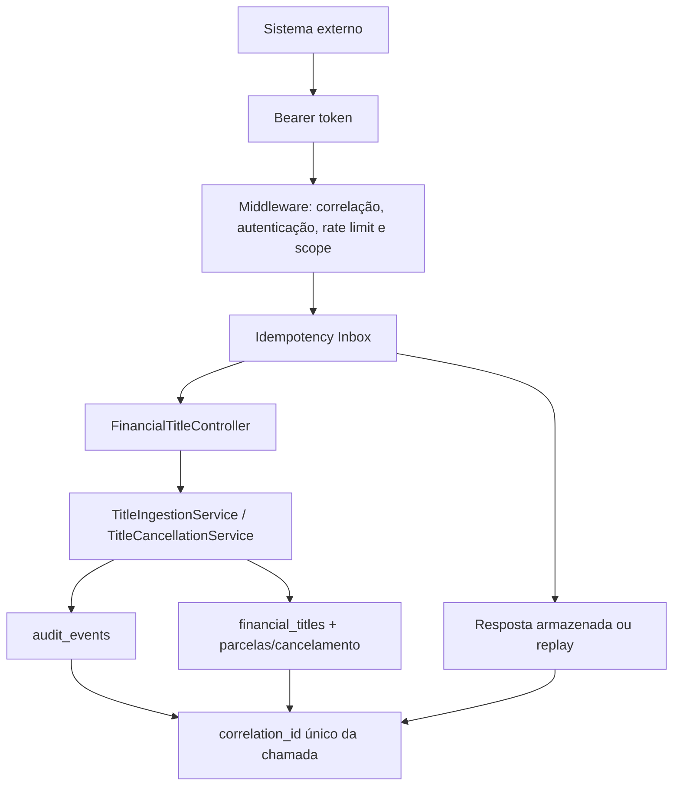

# IMPLEMENTAÇÃO — FASE 2: API V1 DE INTEGRAÇÃO FINANCEIRA ACOP

**Data:** 13/08/2026  
**Projeto:** `gestao-modern`  
**Estratégia:** API aditiva, M2M, versionada e transacional  
**Banco-alvo:** MariaDB 10.1.10, prefixo `avt_`

## 1. Resumo executivo

A Fase 2 tornou o núcleo financeiro da Fase 1 acessível por contrato oficial `/api/v1`. Payables e Receivables agora podem ser criados, consultados, atualizados e cancelados por sistemas autenticados. A origem vem da credencial e o tipo vem da rota; o corpo não pode se passar por outra origem nem trocar o sentido financeiro.

A entrega inclui Bearer tokens opacos armazenados somente como hash, quatro escopos, emissão/revogação por Artisan, rate limit por credencial, correlação ponta a ponta, logs estruturados, erros padronizados, inbox HTTP idempotente com replay, cancelamento não destrutivo, OpenAPI, ADRs, runbook e testes HTTP.

Não houve alteração de frontend, integração bancária, matching, backfill histórico ou código dos sistemas produtores. Os diretórios informados para Contas a Pagar e Contas a Receber não estavam montados neste ambiente e não foram acessados nem modificados.

## 2. Arquitetura da API



As mutações executam inbox, regra financeira e auditoria sob a mesma transação externa. Controllers apenas convertem contrato HTTP em DTO/serviço e resposta explícita; não recalculam dinheiro, parcelas ou estado.

## 3. Endpoints

| Método | Endpoint | Scope | Idempotency-Key | Objetivo |
|---|---|---|---|---|
| POST | `/api/v1/payables` | `payables:write` | obrigatório | criar/reingerir conta a pagar |
| GET | `/api/v1/payables/{external_id}` | `payables:read` | não | consultar payable da origem autenticada |
| PUT | `/api/v1/payables/{external_id}` | `payables:write` | obrigatório | atualizar payable permitido pelo domínio |
| POST | `/api/v1/payables/{external_id}/cancel` | `payables:write` | obrigatório | cancelar payable sem excluí-lo |
| POST | `/api/v1/receivables` | `receivables:write` | obrigatório | criar/reingerir conta a receber |
| GET | `/api/v1/receivables/{external_id}` | `receivables:read` | não | consultar receivable da origem autenticada |
| PUT | `/api/v1/receivables/{external_id}` | `receivables:write` | obrigatório | atualizar receivable permitido pelo domínio |
| POST | `/api/v1/receivables/{external_id}/cancel` | `receivables:write` | obrigatório | cancelar receivable sem excluí-lo |

## 4. Autenticação

Emissão:

```bash
php artisan integration-client:issue AGROCOLITTI "Produtor financeiro" \
  --scope=payables:read --scope=payables:write
```

O serviço gera `acop_` + 64 caracteres hexadecimais derivados de 32 bytes de `random_bytes`. O token bruto aparece uma única vez. `integration_clients` guarda somente SHA-256, prefixo seguro, origem, nome, escopos, estado, expiração e último uso.

Em cada chamada, o middleware calcula SHA-256 do Bearer token, encontra a credencial, valida estado, expiração e `source_system` ativo e disponibiliza esse contexto internamente. O segredo não entra em logs, exceções, auditoria ou resposta.

Revogação:

```bash
php artisan integration-client:revoke <CLIENT_ID>
```

## 5. Scopes

- `payables:read`: consultar Payables;
- `payables:write`: criar, atualizar e cancelar Payables;
- `receivables:read`: consultar Receivables;
- `receivables:write`: criar, atualizar e cancelar Receivables.

## 6. Payloads

Criação de Receivable:

```json
{
  "external_id": "REC-2026-000123",
  "document_number": "NF-12345",
  "issue_date": "2026-08-13",
  "due_date": "2026-09-13",
  "original_amount": "1500.00",
  "discount_amount": "0.00",
  "addition_amount": "0.00",
  "currency": "BRL",
  "party": {"id": null, "type": "CUSTOMER", "name": "Cliente Exemplo"},
  "account_id": null,
  "category_id": null,
  "cost_center_id": null,
  "installment_count": 1,
  "notes": "Referência externa"
}
```

Payable usa o mesmo contrato; a rota impõe `PAYABLE`, e `party.type` normalmente será `SUPPLIER`. Valores são strings decimais com exatamente duas casas e nunca passam por `float`. Datas aceitas são `YYYY-MM-DD`. `external_id` é obrigatório no POST e proibido no corpo do PUT, pois vem do path. Campos internos e campos desconhecidos são rejeitados.

Cancelamento:

```json
{"reason": "Documento cancelado no sistema de origem"}
```

## 7. Respostas

- `CREATED`: título novo, HTTP 201;
- `UPDATED`: mesmo `external_id`, conteúdo alterado e título ainda editável, HTTP 200;
- `IGNORED`: mesmo fato financeiro já existente ou cancelamento idêntico já aplicado com nova chave, HTTP 200;
- `CANCELLED`: status alterado para `CANCELLED`, motivo e auditoria gravados, HTTP 200.

Envelope de sucesso:

```json
{
  "data": {
    "id": 123,
    "external_id": "REC-2026-000123",
    "type": "RECEIVABLE",
    "status": "OPEN",
    "total_amount": "1500.00",
    "currency": "BRL"
  },
  "meta": {
    "correlation_id": "uuid",
    "idempotency_replayed": false,
    "decision": "CREATED"
  }
}
```

O Resource explícito não expõe `payload_hash`, chave idempotente interna, IDs legados ou `deleted_at`.

## 8. Erros

| HTTP | Code | Situação |
|---:|---|---|
| 400 | `IDEMPOTENCY_KEY_REQUIRED` | mutação sem header obrigatório |
| 401 | `UNAUTHENTICATED` | token ausente, inválido, expirado ou revogado |
| 401 | `SOURCE_SYSTEM_INACTIVE` | origem da credencial inativa |
| 403 | `FORBIDDEN` | scope insuficiente |
| 404 | `RESOURCE_NOT_FOUND` | recurso não pertence à origem/tipo ou não existe |
| 405 | `METHOD_NOT_ALLOWED` | método fora do contrato |
| 409 | `IDEMPOTENCY_KEY_REUSED` | mesma chave, requisição diferente |
| 409 | `IDEMPOTENCY_REQUEST_IN_PROGRESS` | chave marcada como em processamento |
| 409 | `TITLE_UPDATE_NOT_ALLOWED` | atualização de título liquidado/cancelado ou troca de tipo |
| 409 | `TITLE_CANCEL_NOT_ALLOWED` | cancelamento viola estado/motivo/origem |
| 409 | `TITLE_ALREADY_SETTLED` | cancelamento de título com liquidação |
| 409 | `DOMAIN_CONFLICT` | outra rejeição de domínio determinística |
| 422 | `VALIDATION_ERROR` | header ou corpo inválido |
| 429 | `RATE_LIMIT_EXCEEDED` | limite por credencial excedido |
| 500 | `INTERNAL_ERROR` | falha inesperada sem detalhes internos |

Todos usam:

```json
{
  "error": {
    "code": "VALIDATION_ERROR",
    "message": "A requisição possui campos inválidos.",
    "details": {},
    "correlation_id": "uuid"
  }
}
```

## 9. Idempotência HTTP

1. **Primeiro envio:** valida chave, calcula o hash canônico, cria `PROCESSING`, executa domínio/auditoria e armazena status/corpo como `COMPLETED`.
2. **Replay:** mesma credencial + chave + método + path + JSON normalizado devolve status e dados armazenados sem executar o fato novamente. Header `Idempotency-Replayed: true`; somente `meta.idempotency_replayed` muda para `true`.
3. **Conflito:** mesma chave com outro método, path, path parameter ou corpo retorna 409.
4. **Concorrência:** lock na credencial serializa as mutações, unique `(integration_client_id, idempotency_key_hash)` impede duplicidade e as constraints de `financial_titles` são a última barreira.
5. **Falha:** resposta 5xx causa rollback da transação financeira e estado `FAILED`, sem corpo definitivo.
6. **Retry:** a mesma chave só pode reprocessar `FAILED` se o hash for idêntico. Erros 4xx determinísticos posteriores à inbox são armazenados e reproduzidos.

A chave integral não é armazenada; a inbox guarda hash e prefixo curto. Authorization, Idempotency-Key e headers irrelevantes não participam do request hash.

## 10. Correlation ID

`X-Correlation-ID` é aceito opcionalmente (1–64 caracteres sem controles); ausente, recebe UUID. O mesmo valor é devolvido no header e atravessa request, log `integration_api_request`, inbox, serviços, cancelamento e `audit_events`. Replay utiliza a correlação original do processamento armazenado.

## 11. Novas tabelas

### `integration_clients`

PK BIGINT `id`; FK `source_system_id -> source_systems.id` com restrict; `name VARCHAR(120)`, `token_prefix VARCHAR(16)`, `token_hash CHAR(64)` unique, `scopes LONGTEXT`, `active BOOLEAN`, `expires_at`, `last_used_at`, timestamps. Índices em `(source_system_id, active)`, prefixo e expiração.

### `integration_requests`

PK BIGINT `id`; FKs para cliente e origem com restrict; hash da chave `CHAR(64)`, prefixo, método, path, request hash, estado, status/corpo da resposta, código de falha, correlação e tempos. Unique `(integration_client_id, idempotency_key_hash)`; índices por origem/estado/data, estado/atualização e correlação. JSON de resposta usa `LONGTEXT`, compatível com MariaDB 10.1.

### `title_cancellations`

PK BIGINT `id`; FKs restrict para título, cliente e origem; motivo `TEXT`, correlação e data de cancelamento. Unique em `financial_title_id`; índices por origem/data, cliente/data e correlação.

### `audit_events` (adição)

Novo `integration_client_id BIGINT` nullable, FK restrict e índice. A nullable preserva eventos humanos/anteriores e separa ator humano de máquina.

## 12. Migrations

- `2026_08_13_000060_create_integration_clients_table.php`;
- `2026_08_13_000070_create_integration_requests_table.php`;
- `2026_08_13_000080_create_title_cancellations_table.php`;
- `2026_08_13_000090_add_integration_client_id_to_audit_events_table.php`.

São aditivas, usam InnoDB, tamanhos de índice conservadores, strings/LONGTEXT no lugar de recursos JSON modernos e não reescrevem migrations antigas.

## 13. Testes

Baseline anterior: **30 testes, 111 asserções**. Resultado após a Fase 2: **41 testes, 219 asserções**, todos aprovados localmente em SQLite isolado.

Cobertura nova: token ausente/inválido/revogado, origem inativa, scope, hash de token, POST/GET/PUT dos tipos, tipo/origem impostos, validação de valores/datas/campos, isolamento por origem, parcelas, recurso seguro, correlação/auditoria, chave obrigatória, replay de status/dados, conflitos por conteúdo/rota, mesma identidade com chaves diferentes, mesmo `external_id` em origens diferentes, cancelamento persistente e auditável, bloqueio com liquidação, rate limit e retry após 5xx.

SQLite não prova semântica específica de locks do MariaDB. A unique constraint e o fluxo foram testados; a corrida real está explicitamente no runbook de homologação MariaDB.

## 14. Segurança

- token aleatório de 256 bits e somente SHA-256 persistido;
- comparação/busca sem segredo bruto em banco/log;
- origem derivada da credencial e tipo derivado da rota;
- scopes mínimos e revogação individual;
- rate limit configurável por cliente (`INTEGRATION_API_RATE_LIMIT`, default 60/min);
- API stateless separada de sessão/CSRF web;
- nenhuma abertura CORS permissiva adicionada;
- validação com allowlist e rejeição de campos internos/desconhecidos;
- resposta explícita sem campos internos;
- erros sem stack trace, SQL, arquivo, configuração ou credencial;
- logs sem Authorization, chave completa ou payload financeiro;
- FKs, unique constraints, transações e locks pessimistas;
- cancelamento sem DELETE e sem estorno automático.

Em produção, HTTPS é obrigatório e o token deve ser entregue/armazenado em cofre de segredos.

## 15. Compatibilidade com legado

`avt_lancamentos`, `avt_recebimentos`, `avt_movimentos` e `avt_conciliacoes` continuam preservadas. Nenhuma migration, model legado, controller web, rota web ou tela foi convertido. A API grava exclusivamente no núcleo moderno e nas tabelas novas. Também não houve acesso ou mudança aos produtores externos indicados em `G:\xampp\htdocs\contas` e `G:\xampp\htdocs\contasareceber`.

## 16. Arquivos alterados

- configuração/bootstrap: `.env.example`, `bootstrap/app.php`, `config/integrations.php`, `routes/api.php`, `app/Providers/AppServiceProvider.php`;
- domínio/aplicação: `AuditEventRecorder`, `DatabaseAuditEventRecorder`, `TitleIngestionService`, `TitleCancellationService`, `CancellationResult`, quatro exceptions financeiras, serviço/DTO de credenciais;
- HTTP: quatro auxiliares de API, seis middlewares, dois Form Requests, `FinancialTitleResource`, `FinancialTitleController`;
- console: `IssueIntegrationClient`, `RevokeIntegrationClient`;
- models: `AuditEvent`, `FinancialTitle`, `SourceSystem`, `IntegrationClient`, `IntegrationRequest`, `TitleCancellation`;
- banco: as quatro migrations listadas na seção 12;
- testes: `FinancialCoreTest.php`, `IntegrationApiV1Test.php`;
- documentação: OpenAPI v1, ADR-004, ADR-005, runbook e este documento.

## 17. Problemas encontrados

- O ambiente atual não expõe a unidade `G:`; portanto não foi possível sequer fazer fingerprint dos produtores. Para cumprir a restrição de segurança, nenhuma tentativa alternativa de escrita/acesso foi feita.
- O repositório entregue não possui baseline Git rastreado (arquivos aparecem como untracked), o que limita um diff histórico confiável. O estado foi preservado e nenhum commit/reset foi executado.
- A suíte usa SQLite em memória; isso valida contrato e constraints, mas não certifica lock/concurrency do MariaDB 10.1.
- A primeira simulação de rollback isolado revelou que SQLite não remove uma FK pelo nome. O `down()` passou a escolher colunas no SQLite e o nome explícito no MariaDB; o ciclo foi repetido após a correção.
- Não foi executada migration em banco real nem chamada contra produtor real, conforme proibido.

## 18. Débitos técnicos

- executar homologação concorrente no MariaDB 10.1;
- definir retenção/expurgo operacional de `integration_requests` antes de volume elevado;
- conectar os sistemas produtores somente em mudança separada, com contrato OpenAPI, credencial mínima, homologação e rollback;
- definir gestão corporativa/cofre de secrets e processo de rotação em produção.

## 19. Próximo passo

Somente após homologar e estabilizar esta API, a Fase 3 pode introduzir `bank_transaction`, `import_batch`, entrada de transações e deduplicação bancária. Nada da Fase 3 foi antecipado.

## 20. Testes manuais com curl

Defina uma URL e use sempre placeholders; nunca copie token real para documentação.

Criar Receivable:

```bash
curl -X POST "http://localhost/api/v1/receivables" \
  -H "Authorization: Bearer <TOKEN>" \
  -H "Idempotency-Key: rec-123-v1" \
  -H "X-Correlation-ID: <UUID>" \
  -H "Content-Type: application/json" \
  -d '{"external_id":"REC-123","issue_date":"2026-08-13","due_date":"2026-09-13","original_amount":"1500.00","discount_amount":"0.00","addition_amount":"0.00","currency":"BRL","party":{"type":"CUSTOMER","name":"Cliente Exemplo"},"installment_count":1}'
```

Replay: execute exatamente o mesmo comando, inclusive chave e corpo; espere o mesmo status/dados e `Idempotency-Replayed: true`.

Consultar:

```bash
curl "http://localhost/api/v1/receivables/REC-123" \
  -H "Authorization: Bearer <TOKEN>" \
  -H "X-Correlation-ID: <UUID>"
```

Atualizar (sem `external_id` no corpo):

```bash
curl -X PUT "http://localhost/api/v1/receivables/REC-123" \
  -H "Authorization: Bearer <TOKEN>" \
  -H "Idempotency-Key: rec-123-update-v2" \
  -H "Content-Type: application/json" \
  -d '{"issue_date":"2026-08-13","due_date":"2026-09-20","original_amount":"1550.00","discount_amount":"0.00","addition_amount":"0.00","currency":"BRL","installment_count":1}'
```

Cancelar:

```bash
curl -X POST "http://localhost/api/v1/receivables/REC-123/cancel" \
  -H "Authorization: Bearer <TOKEN>" \
  -H "Idempotency-Key: rec-123-cancel-v1" \
  -H "Content-Type: application/json" \
  -d '{"reason":"Documento cancelado na origem"}'
```

Erro de idempotência: repita o primeiro POST com `Idempotency-Key: rec-123-v1`, mas altere `original_amount`; espere HTTP 409 e `IDEMPOTENCY_KEY_REUSED`.
