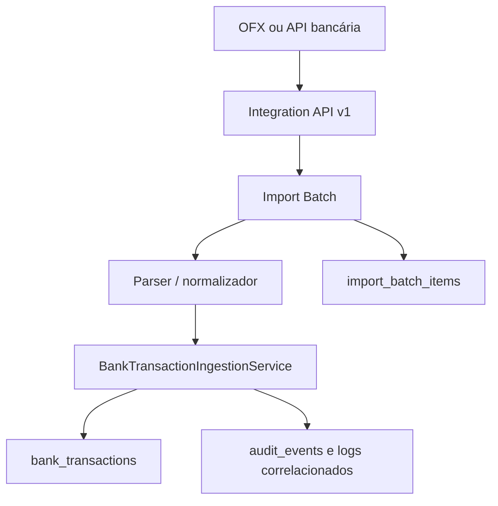
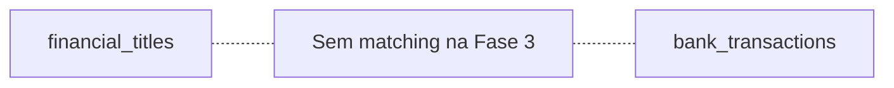

# Implementação — Fase 3: transações bancárias e importação

**Data:** 13/08/2026  
**Estado:** implementada e validada localmente; não aplicada em banco real.

## Resumo executivo

O novo núcleo agora consegue registrar fatos bancários por API e importar extratos OFX com conta, origem, identidade forte, lote, resultado por linha, auditoria e correlação. Reenvios HTTP, arquivos repetidos e transações repetidas são tratados em camadas separadas. Nenhuma transação bancária liquida ou altera títulos; matching e conciliação permanecem fora desta fase.

## Arquitetura





A credencial determina `source_system_id`; o cliente não pode escolher a origem no payload. `account_id` é obrigatório e validado contra o cadastro legado de contas apenas em leitura. O serviço de ingestão centraliza normalização, identidade, imutabilidade e auditoria para ambos os canais.

## Novas tabelas

### `import_batches`

Representa uma tentativa lógica de entrada API ou arquivo. PK `id`; FKs para `source_systems` e `integration_clients`; `account_id` obrigatório sem FK para o cadastro legado. Guarda canal/formato, nome normalizado, hash do arquivo, estado, contadores, período, correlação, tempos, falha segura e metadados. Índices cobrem origem+conta+hash, origem+status+data, conta+data e correlação.

### `bank_transactions`

Representa o fato bancário imutável. PK `id`; FKs para origem e lote; conta obrigatória sem FK legada. Guarda identidade forte, direção, valores `DECIMAL(15,2)`, moeda, datas, descrição original, referências, contraparte, saldo e hashes. A constraint única `(account_id, source_system_id, external_id)` é a defesa final de identidade. Índices suportam conta/data, conta/direção/data, origem/ID, lote e End-to-End ID.

### `import_batch_items`

Rastreia cada linha. PK `id`; FKs para lote e, quando criada/encontrada, transação; posição única dentro do lote. Guarda ID externo, resultado `IMPORTED`, `DUPLICATE` ou `REJECTED`, erro seguro, hash da linha e metadados mínimos. Índices cobrem lote+resultado e transação.

Todas as migrations têm `up`/`down`, nomes de índices compatíveis e não referenciam as quatro tabelas legadas protegidas.

## Modelo `bank_transaction`

- Identidade: conta + origem autenticada + `external_id` forte; no OFX, `FITID`.
- Direção/valor: `CREDIT` ou `DEBIT` e valor positivo em DECIMAL; sinal do OFX é normalizado.
- Datas: `transaction_date` obrigatória e `posted_at` opcional com timezone.
- Evidência: descrição original e referências opcionais (`document_number`, `bank_reference`, `end_to_end_id`).
- Contexto: conta explícita, origem, lote, contraparte e saldo posterior quando informado.
- Imutabilidade: mesma identidade e conteúdo é duplicidade normal; conteúdo divergente é conflito. Não há PUT/DELETE.

## Ciclo de `import_batch`

```text
RECEIVED -> PROCESSING -> COMPLETED
                       -> PARTIAL
                       -> FAILED
```

`COMPLETED` admite itens importados e duplicados sem rejeições. `PARTIAL` combina itens aceitos/duplicados com rejeitados. `FAILED` cobre erro estrutural ou todas as linhas rejeitadas. Cada lote preserva contadores, correlação e falha resumida, sem guardar arquivo bruto.

## Deduplicação

### Idempotência HTTP

Toda mutação exige `Idempotency-Key`. A inbox continua por credencial. Para JSON, o hash canônico da Fase 2 foi preservado. Para multipart, entram os campos e SHA-256 dos bytes do arquivo; filename e MIME fornecidos pelo cliente não definem identidade. Mesma chave/requisição reproduz a resposta; mesma chave com outro conteúdo retorna `409`.

O upload usa modo idempotente desacoplado: transações curtas preparam/finalizam a inbox e o arquivo é processado fora de uma transação SQL longa. Resposta 5xx deixa tentativa retryable. A validação concorrente real continua pendente no MariaDB.

### Hash do arquivo

SHA-256 identifica o mesmo conteúdo na mesma origem e conta. Outro envio, mesmo com nova chave HTTP, retorna o lote não falho existente e não duplica transações. Um lote `FAILED` não impede correção/reprocessamento.

### Identidade forte

O serviço e a constraint usam `account_id + source_system_id + external_id/FITID`. Arquivos sobrepostos compartilham apenas FITIDs repetidos. Mesma identidade com payload normalizado diferente é conflito e não sobrescreve o fato.

### Valor/data e identidade fraca

Valor e data nunca deduplicam. Duas linhas legítimas iguais nesses campos, mas com IDs fortes distintos, geram duas transações. Linha OFX sem FITID é rejeitada e fica rastreável; não é criado hash heurístico como identidade.

## OFX

O importador suporta o subconjunto verificado de OFX SGML/XML com blocos fechados `STMTTRN`. Usa FITID, TRNAMT, DTPOSTED, NAME/MEMO, CHECKNUM, REFNUM, ENDTOENDID e CURDEF; BANKID, ACCTID, ACCTTYPE, período e saldo contábil viram metadados do lote.

Arquivos vazios, grandes, falsamente nomeados, sem estrutura esperada ou com DTD/entidades externas são rejeitados. O parser não usa DOM/XML, rede ou resolução de entidade. O nome é reduzido a basename e normalizado. O arquivo bruto não é persistido nem logado. Não há promessa de suporte universal por banco; CNAB, CSV e Open Finance não foram implementados.

## API v1

Os oito contratos financeiros da Fase 2 foram preservados e cinco operações foram adicionadas:

| Método | Endpoint | Scope | Objetivo |
| ------ | -------- | ----- | -------- |
| POST | `/api/v1/payables` | `payables:write` | Criar/reingerir payable |
| GET | `/api/v1/payables/{external_id}` | `payables:read` | Consultar payable |
| PUT | `/api/v1/payables/{external_id}` | `payables:write` | Atualizar payable editável |
| POST | `/api/v1/payables/{external_id}/cancel` | `payables:write` | Cancelar payable |
| POST | `/api/v1/receivables` | `receivables:write` | Criar/reingerir receivable |
| GET | `/api/v1/receivables/{external_id}` | `receivables:read` | Consultar receivable |
| PUT | `/api/v1/receivables/{external_id}` | `receivables:write` | Atualizar receivable editável |
| POST | `/api/v1/receivables/{external_id}/cancel` | `receivables:write` | Cancelar receivable |
| POST | `/api/v1/bank-transactions` | `bank-transactions:write` | Ingerir fato canônico |
| GET | `/api/v1/bank-transactions/{account_id}/{external_id}` | `bank-transactions:read` | Consultar fato isolado por origem |
| POST | `/api/v1/bank-imports/ofx` | `bank-imports:write` | Importar OFX multipart |
| GET | `/api/v1/bank-imports/{id}` | `bank-imports:read` | Consultar lote |
| GET | `/api/v1/bank-imports/{id}/items` | `bank-imports:read` | Listar itens, 50 por página |

O OpenAPI v1 documenta payloads, multipart, headers, respostas, scopes e códigos bancários. Não existem rotas bancárias PUT ou DELETE.

## Testes

- Antes: **41 testes / 219 asserções**.
- Depois: **55 testes / 346 asserções**.
- Resultado final local: todos aprovados.

Os 14 cenários bancários cobrem autenticação, scopes, conta inexistente, crédito/débito, consulta, isolamento por origem, idempotência JSON e de arquivo, conflito imutável, duplicidade forte, não deduplicação por valor/data, OFX válido, arquivo repetido, períodos sobrepostos, linha inválida, estados/contadores, paginação, auditoria, upload vazio/inválido/grande/extensão falsa/XXE e garantia explícita de que títulos, liquidações e movimentos legados não mudam.

Fixtures sintéticos: extrato válido, parcial e dois extratos sobrepostos. Nenhum dado bancário real foi incluído.

## Segurança

- tamanho OFX configurável, padrão 5 MiB;
- validação de extensão, bytes, estrutura e upload temporário;
- parser sem entidade externa, DTD, rede ou expansão XML;
- basename e remoção de controles contra path traversal;
- token opaco só por hash, scopes mínimos e isolamento pela origem;
- arquivo, token, chave completa, payload e descrição integral não são logados;
- resources não expõem hashes ou metadados internos;
- auditoria e logs carregam `correlation_id`, cliente, origem, lote e contadores.

## Compatibilidade com legado

- `avt_lancamentos`: intacta;
- `avt_recebimentos`: intacta;
- `avt_movimentos`: intacta;
- `avt_conciliacoes`: intacta.

Os produtores `G:\xampp\htdocs\contas` e `G:\xampp\htdocs\contasareceber` não foram acessados nem modificados. As migrations da Fase 3 criam somente tabelas novas. O teste de não alteração confirma que importação não cria liquidação, não muda título e não cria movimento legado.

## Banco real

- Migrations aplicadas em banco real? **NÃO**.
- Homologação MariaDB 10.1 realizada? **NÃO**.
- Concorrência MariaDB validada? **NÃO**.

Desenvolvimento e testes ocorreram em SQLite isolado. Compatibilidade e locks precisam de homologação dedicada antes de produção.

## Arquivos alterados

- migrations `000100`, `000110`, `000120`;
- domínio, enums, DTOs, exceções e serviços em `app/Domain/Banking` e `app/Application/Banking`;
- contrato/parser em `app/Contracts/BankStatementImporter.php` e `app/Infrastructure/Banking`;
- models `BankTransaction`, `ImportBatch`, `ImportBatchItem` e relações de origem/cliente;
- controllers, requests e resources bancários da API v1;
- `CanonicalRequestHasher` e `EnsureIdempotentRequest` para arquivo/processamento desacoplado;
- `routes/api.php`, `config/banking.php`, `config/integrations.php`, `.env.example` e provider;
- OpenAPI, ADR-006/007/008, runbook da Fase 3;
- `BankingApiV1Test`, `MigrationSafetyTest` e quatro fixtures sintéticos.

## Problemas encontrados

- o cadastro `contas` é legado e não possui contrato relacional moderno comprovado; por segurança, não recebeu FK;
- OFX varia por instituição, portanto o suporte é conscientemente restrito ao subconjunto testado;
- o repositório recebido não possui baseline Git rastreado, então `git diff --stat` não representa os arquivos modificados;
- não havia homologação MariaDB 10.1 disponível para validar locks e concorrência.

## Débitos técnicos

- homologar MariaDB 10.1, especialmente corrida de inbox, arquivo e constraint;
- validar fixtures reais anonimizados por banco e ampliar dialetos com testes;
- definir retenção/expurgo de inbox, lotes, itens e hashes;
- definir mapeamento assistido de metadados OFX para conta, sem criação automática;
- avaliar CNAB, CSV e Open Finance em fases próprias;
- definir política de dados de contraparte e formatos específicos;
- implementar matching e conciliação persistente somente na Fase 4.

## Resultado e limite da fase

O sistema agora responde com rastreabilidade ao que o banco registrou. Ele propositalmente ainda não responde a qual título cada fato corresponde. Não foram implementados matching, score, divergências, fechamento, dashboard bancário ou liquidação automática.
