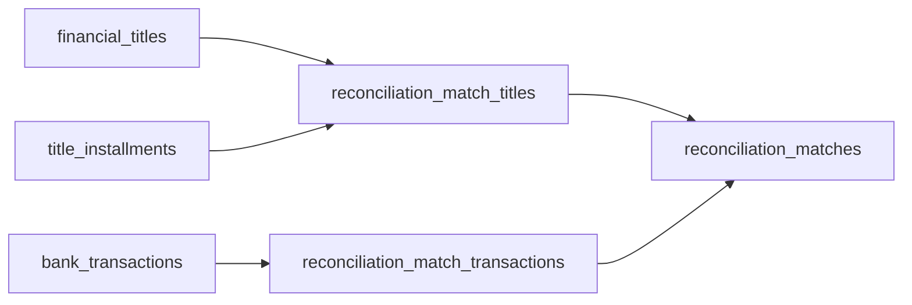
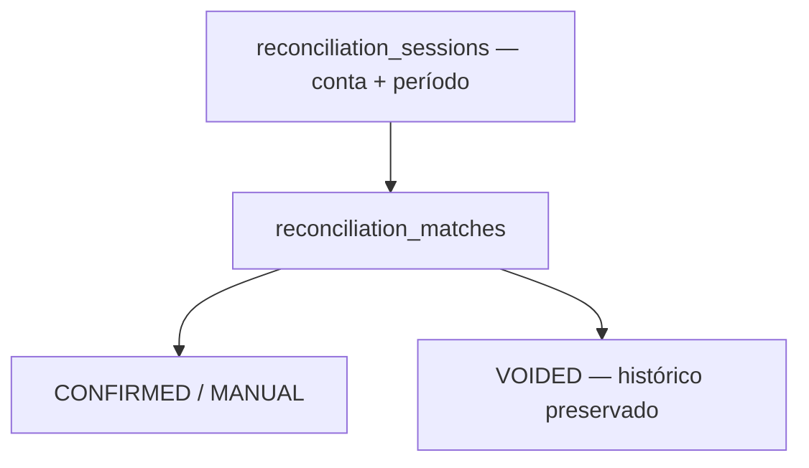

# Implementação — Fase 4: conciliação persistente e manual

**Data:** 13/08/2026  
**Estado:** implementada e validada localmente; desabilitada por padrão; não aplicada em banco real.

## Resumo executivo

O núcleo moderno agora guarda sessões de conciliação por conta/período e decisões manuais persistentes entre parcelas de títulos e transações bancárias. Alocações parciais e composições 1:1, 1:N, N:1 e N:N são suportadas com valor em DECIMAL/centavos, igualdade exata, limites de disponibilidade, locks, usuário humano, correlação, auditoria e histórico de desfazimento.

Mudaram apenas estruturas aditivas dentro de `gestao-modern`, uma interface web paralela, gates/feature flag, relações modernas e testes/documentação. Propositalmente não mudaram produtores externos, conciliação antiga, APIs v1, títulos, parcelas, liquidações, fatos bancários nem tabelas financeiras legadas. Não foram criados matching automático, score, sugestão, tarifa, tolerância, fechamento ou baixa automática.

## Arquitetura





`ManualReconciliationService` é o único fluxo de confirmação/desfazimento. Ele bloqueia sessão e recursos, revalida toda regra e persiste match, alocações e auditoria na mesma transação. A disponibilidade é derivada somente de alocações em matches `CONFIRMED`.

## Tabelas e migrations

### `2026_08_13_000130_create_reconciliation_sessions_table`

Cria `reconciliation_sessions` com conta, período, `OPEN/IN_REVIEW`, ator de criação/atualização, correlação e timestamps. Possui unique de conta+início+fim, índice conta+status+período e índice de correlação. Conta/usuário não têm FK legada.

### `2026_08_13_000140_create_reconciliation_matches_table`

Cria `reconciliation_matches` com FK `RESTRICT` para sessão, `CONFIRMED/VOIDED`, método `MANUAL`, confirmação, void, motivo, correlação e timestamps. Índices cobrem sessão+status+data e correlação.

### `2026_08_13_000150_create_reconciliation_match_titles_table`

Cria `reconciliation_match_titles` com FKs `RESTRICT` para match, título moderno e parcela moderna, `allocated_amount DECIMAL(15,2)`, timestamps, unique match+parcela e índices por título/parcela. O serviço sempre resolve uma parcela concreta.

### `2026_08_13_000160_create_reconciliation_match_transactions_table`

Cria `reconciliation_match_transactions` com FKs `RESTRICT` para match e transação moderna, `allocated_amount DECIMAL(15,2)`, timestamps, unique match+transação e índice da transação.

Todas têm `down()` em ordem dependente e criam somente tabelas novas. Nenhuma migration referencia por nome ou altera as quatro tabelas protegidas.

## Regras implementadas

- sessão obrigatória por conta/período, sem duplicidade;
- apenas `OPEN` e `IN_REVIEW`, sem fechamento;
- match apenas `MANUAL`, inicialmente `CONFIRMED`;
- ao menos uma alocação positiva de cada lado;
- soma de títulos exatamente igual à soma bancária em centavos inteiros;
- 1:1, 1:N, N:1, N:N e parcial;
- PAYABLE somente com DEBIT; RECEIVABLE somente com CREDIT;
- sem mistura de tipos/direções e com moeda uniforme;
- título e transação na conta da sessão;
- transação dentro do período; vencimento do título pode ser anterior;
- título/parcela cancelado bloqueado; título sem conta explícita bloqueado;
- título parcelado exige parcela; parcela única pode ser resolvida;
- disponibilidade não pode ficar negativa;
- `void` não apaga, exige motivo e libera disponibilidade derivada;
- criação/void não alteram título, parcela, settlement ou banco.

## Concorrência e atomicidade

Confirmação e void usam transação com até três tentativas. A ordem de lock é sessão, transações por ID, títulos por ID e parcelas por ID. A soma confirmada é recalculada sob esses locks antes do insert. Isso serializa operações que competem pelo mesmo fato e impede over-allocation na aplicação. A unique da sessão é a defesa final para criação concorrente.

SQLite aprovou atomicidade e a defesa sequencial, mas não comprova `SELECT ... FOR UPDATE` do InnoDB. Concorrência simultânea real permanece requisito de homologação no MariaDB 10.1.

## Interface, rotas e segurança

A nova superfície autenticada fica em `/reconciliacao-v2`, totalmente separada de `/conciliacoes`:

| Método | Rota | Permissão |
| --- | --- | --- |
| GET | `/reconciliacao-v2` | `reconciliation:view` |
| GET | `/reconciliacao-v2/nova` | `reconciliation:manage` |
| POST | `/reconciliacao-v2` | `reconciliation:manage` |
| GET | `/reconciliacao-v2/sessoes/{session}` | `reconciliation:view` |
| POST | `/reconciliacao-v2/sessoes/{session}/matches` | `reconciliation:manage` |
| GET | `/reconciliacao-v2/sessoes/{session}/matches/{match}` | `reconciliation:view` |
| POST | `/reconciliacao-v2/sessoes/{session}/matches/{match}/void` | `reconciliation:manage` |

`RECONCILIATION_V2_ENABLED=false` é o padrão. O middleware responde `404` quando desligada e o menu é ocultado. Os gates usam allowlists explícitas de IDs; lista vazia não libera nenhum usuário e `manage` implica `view`. FormRequests usam CSRF, rejeitam campos controlados pelo servidor e o ator sempre vem da autenticação. A busca aninhada de match pela sessão bloqueia IDOR.

A tela exibe sessões, filtros explícitos, disponibilidade original/conciliada/restante, seleção e valores manuais, histórico e void. Ela não calcula candidatos nem score.

## APIs das Fases 2 e 3

As 13 operações de `/api/v1` foram preservadas. Nenhuma rota de conciliação foi adicionada à API de integração e o OpenAPI v1 não precisou mudar.

## Testes

```text
ANTES
55 testes
346 asserções

DEPOIS
77 testes
458 asserções
```

Os 22 novos testes cobrem feature flag e legado paralelo; gates de view/manage; criação, validação, ator, auditoria e duplicidade de sessão; rejeição de campos forjados; renderização e ciclo web; 1:1, 1:N, N:1 e N:N; parcial e status/disponibilidade derivados; over-allocation de título e banco; atomicidade do desbalanceamento; PAYABLE×CREDIT e RECEIVABLE×DEBIT; mistura de direções; conta; período; título antigo; moeda; conta nula; cancelamento; parcela ambígua e explícita; void/histórico/reuso; IDOR; migration safety; 13 operações antigas.

Resultado final local: `php artisan test --compact` aprovou 77/77 e 458 asserções.

## Testes de proteção

- não escrita no legado: snapshots de contagem/marcadores das quatro tabelas permanecem idênticos;
- título/parcela: atributos antes/depois do match são idênticos;
- settlement: contagem permanece zero e nenhum serviço de baixa é chamado;
- transação: snapshot imutável antes/depois, inclusive após void;
- feature flag: `/reconciliacao-v2` retorna 404 por padrão e menu não aparece;
- conciliação antiga: `/conciliacoes` continua respondendo;
- API: exatamente 13 operações `/api/v1`, nenhuma de conciliação;
- migration: quatro criações aditivas, sem `Schema::table` nem referência às tabelas protegidas.

## CONTAS A PAGAR / CONTAS A RECEBER

```text
G:\xampp\htdocs\contas acessado? NÃO
G:\xampp\htdocs\contas modificado? NÃO

G:\xampp\htdocs\contasareceber acessado? NÃO
G:\xampp\htdocs\contasareceber modificado? NÃO
```

Nenhum comando, migration, teste, Composer, NPM ou escrita foi executado nesses produtores.

## Segurança do legado

```text
avt_lancamentos alterada? NÃO
avt_recebimentos alterada? NÃO
avt_movimentos alterada? NÃO
avt_conciliacoes alterada? NÃO
```

A rota/controller/view da conciliação antiga também não foram substituídos nem redirecionados.

## Homologação

```text
MariaDB 10.1 homologado? NÃO
Concorrência real validada? NÃO
Migrations aplicadas em banco real? NÃO
```

Testes usaram SQLite isolado. `migrate:status`/`--pretend` são apenas inspeções; nenhuma migration real foi aplicada por esta fase.

## Arquivos criados ou alterados

- `.env.example`;
- `config/reconciliation.php`;
- `bootstrap/app.php`;
- `app/Providers/AppServiceProvider.php`;
- `app/Application/Reconciliation/ManualReconciliationService.php`;
- `app/Application/Reconciliation/ReconciliationAllocationQuery.php`;
- `app/Application/Reconciliation/ReconciliationFeature.php`;
- `app/Application/Reconciliation/ReconciliationSessionService.php`;
- `app/Domain/Reconciliation/Enums/ReconciliationSessionStatus.php`;
- `app/Domain/Reconciliation/Enums/ReconciliationMatchStatus.php`;
- `app/Domain/Reconciliation/Enums/ReconciliationMethod.php`;
- `app/Domain/Reconciliation/Exceptions/ReconciliationRuleViolation.php`;
- `app/Domain/Reconciliation/ReconciliationTitleAllocationData.php`;
- `app/Domain/Reconciliation/ReconciliationTransactionAllocationData.php`;
- `app/Models/ReconciliationSession.php`;
- `app/Models/ReconciliationMatch.php`;
- `app/Models/ReconciliationMatchTitle.php`;
- `app/Models/ReconciliationMatchTransaction.php`;
- `app/Models/FinancialTitle.php`;
- `app/Models/TitleInstallment.php`;
- `app/Models/BankTransaction.php`;
- `app/Http/Middleware/EnsureReconciliationV2Enabled.php`;
- `app/Http/Controllers/ReconciliationV2Controller.php`;
- `app/Http/Requests/StoreReconciliationSessionRequest.php`;
- `app/Http/Requests/StoreManualReconciliationRequest.php`;
- `app/Http/Requests/VoidReconciliationMatchRequest.php`;
- migrations `000130`, `000140`, `000150`, `000160`;
- `routes/web.php`;
- `resources/views/layouts/app.blade.php`;
- quatro views em `resources/views/reconciliation-v2`;
- `public/css/app.css`;
- `tests/Feature/ReconciliationV2Test.php`;
- `tests/Feature/MigrationSafetyTest.php`;
- ADR-009, ADR-010, runbook e este relatório.

## Problemas e limitações reais

- O repositório recebido não possui baseline Git rastreado; `git diff --stat` não consegue representar o delta da fase.
- A primeira verificação ponta a ponta da view encontrou uma diretiva Blade adjacente que não compilava; a estrutura foi corrigida e um teste web foi mantido para regressão.
- A allowlist por ID é segura e simples, mas precisa de processo administrativo fora do código; não existe RBAC moderno persistente.
- Não há MariaDB 10.1 disponível para provar locks, deadlocks, índices e rollback operacional.
- O cadastro de conta e usuários continua legado, deliberadamente sem FK moderna.
- Duas paginações na mesma tela limitam a seleção aos itens renderizados; composições continuam suportadas pelo domínio, mas volumes grandes podem exigir uma UX futura.

## Decisões pendentes — não inventadas

- se e quando confirmar match deve criar `title_settlement`;
- etapa/autoridade adicional para efetivar baixa;
- tolerância de diferenças e arredondamento;
- tarifas, juros, descontos e encargos;
- estornos bancários e financeiros;
- janela/tolerância de datas;
- fechamento, reabertura e segregação de funções;
- matching, candidatos e score da Fase 5;
- política de retenção e relatórios de conciliação;
- modelo RBAC definitivo e política para títulos sem conta.

## Resultado e limite da fase

Um operador autorizado pode declarar e preservar “esta movimentação corresponde a este título”, inclusive em composições e valores parciais, e desfazer a decisão sem apagar evidência. O sistema ainda não encontra relações sozinho, não dá baixa, não aceita diferenças e não fecha períodos.

