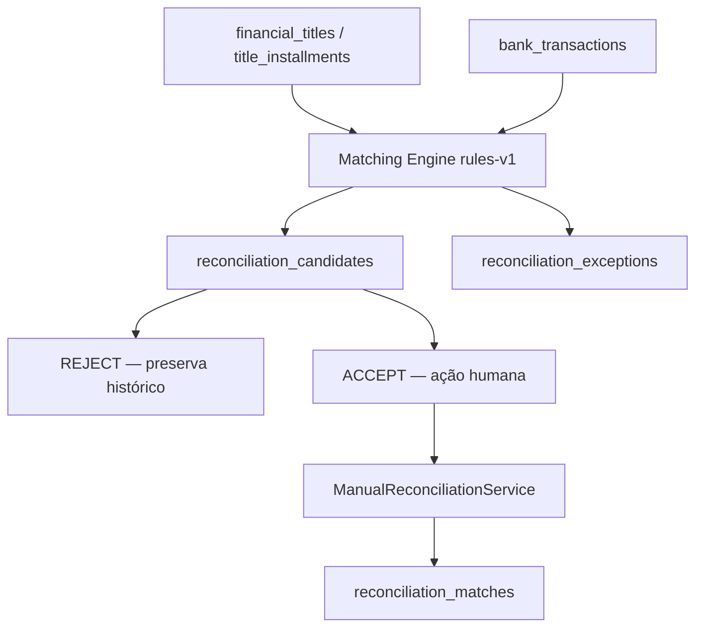

# Implementação — Fase 5: matching, candidatos e divergências

**Data:** 13/08/2026  
**Escopo:** somente `gestao-modern`  
**Estado:** implementado e testado localmente; flags desligadas por padrão; nenhuma migration aplicada em banco real.

## Resumo executivo

Foi criado um motor de regras determinístico e explicável que gera candidatos persistentes e uma fila de divergências. Score serve para priorização, não para autoridade. O operador continua responsável por gerar, inspecionar e aceitar/rejeitar. Aceite chama `ManualReconciliationService` e revalida os fatos sob lock antes de criar um match.

Propositalmente não foram automatizados: confirmação, settlement/baixa, alteração de título/parcela, alteração de transação, diferença, tarifa, juros, desconto, estorno ou fechamento.

## Componentes

- `ReconciliationTextNormalizer`: caixa, acentos, espaços, tokens e identificadores;
- `ReconciliationCandidateScorer`: sinais, pesos, score 0–100, banda e evidência;
- `ReconciliationMatchingEngine`: pré-filtro, disponibilidade, 1:1/1:N/N:1, limites, assinatura e filas;
- `ReconciliationCandidateService`: aceite/rejeição, locks, revalidação e auditoria;
- `ReconciliationExceptionService`: justificativa auditável;
- middleware de matching: exige as flags v2 e matching;
- UI dentro da sessão v2: geração, filtros, detalhe, decisão e divergências.

## Tabelas novas

### `reconciliation_candidates` — migration 000170

Objetivo: cabeçalho versionado da hipótese. PK `id`; FKs `reconciliation_session_id` (RESTRICT) e `reconciliation_match_id` opcional (SET NULL). Campos: tipo, status, score, confidence, engine_version, signature SHA-256, evidência LONGTEXT/JSON, atores/datas de geração/decisão, motivo, correlação e timestamps. Unique `(session, engine_version, signature_hash)`; índice da fila `(session, status, score)`. `down()` remove apenas esta tabela moderna.

### `reconciliation_candidate_titles` — migration 000180

Objetivo: títulos/parcelas concretos e valor proposto. PK `id`; FKs para candidato (CASCADE), título e parcela modernos (RESTRICT); `DECIMAL(15,2)`; unique por candidato/parcela. `down()` aditivo e isolado.

### `reconciliation_candidate_transactions` — migration 000190

Objetivo: fatos bancários e valor proposto. PK `id`; FKs para candidato (CASCADE) e transação moderna (RESTRICT); `DECIMAL(15,2)`; unique por candidato/transação. `down()` aditivo e isolado.

### `reconciliation_exceptions` — migration 000200

Objetivo: divergência persistente. PK `id`; FK obrigatória para sessão e opcionais para título/parcela/transação modernos; tipo/status; valor/diferença `DECIMAL(15,2)`; evidência LONGTEXT/JSON; versão/assinatura; atores/datas/motivo; correlação. Unique por sessão/versão/assinatura e índice `(session,status,type)`. `down()` remove somente a estrutura moderna.

Nenhuma migration anterior foi reescrita.

## Score rules-v1

Pesos provisórios: valor exato 30; documento de negócio exato 30; documento em referência 20; documento da contraparte exato 30; nome exato 15; tokens de nome 8; mesma data 12; até 3 dias 8; restante da janela 3. HIGH ≥75, MEDIUM ≥50, LOW abaixo. Score mínimo 25.

Normalização remove variações de caixa/acentos/espaços e pontuação de identificador. Documento da contraparte só é comparado quando o dado disponível tem 11/14 dígitos. Evidência persiste códigos/impactos/distância, não documento, descrição ou nome completos.

Configurações técnicas provisórias em `config/reconciliation_matching.php`: janela 10 dias, pool global 200, pool local de composição 12, até 100 subconjuntos por recurso, composição até 3, máximo 8 candidatos por recurso e delta de ambiguidade 5. Não são regras de negócio homologadas.

## Semântica operacional

- `PENDING`: candidato disponível para decisão;
- `ACCEPTED`: revalidado e ligado ao match criado;
- `REJECTED`: decisão humana com motivo;
- `STALE`: composição deixou de ser válida;
- exceções: `OPEN`, `IN_REVIEW`, `RESOLVED`, `JUSTIFIED`.

Geração atualiza candidatos pendentes idênticos e marca pendentes ausentes como `STALE`; não ressuscita decisões. Duas sugestões equivalentes geram `AMBIGUOUS_CANDIDATES`. Documento forte com valor diferente gera `AMOUNT_MISMATCH`. Casos sem solução ficam em fila. Ao aceitar, exceções abertas relacionadas são resolvidas apenas depois de o serviço manual confirmar.

## Exemplos sintéticos

- **A — alta confiança:** valor R$ 1.000,00, documento normalizado igual, nome igual e mesma data → score alto; continua pendente até aceite.
- **B — ambiguidade:** dois títulos de R$ 100,00 com sinais equivalentes para uma transação → dois candidatos e divergência; nenhum vencedor automático.
- **C — diferença:** documento `SPECIAL-9`, título R$ 150,00 e banco R$ 125,00 → `AMOUNT_MISMATCH`; nenhum ajuste.
- **D — composição:** título R$ 1.000,00 e banco R$ 600,00 + R$ 400,00 → `ONE_TO_MANY`, limitado e revisável.
- **E — nenhum candidato:** transação R$ 987,65 sem vínculo suficiente → `NO_CANDIDATE`.

## Feature flags e rotas

`RECONCILIATION_V2_ENABLED=false` desliga toda v2. `RECONCILIATION_MATCHING_ENABLED=false` desliga somente motor/sugestões/fila e deixa a conciliação manual disponível quando a v2 estiver ligada. Foram adicionadas 6 rotas web autenticadas e aninhadas por sessão: gerar, ver/aceitar/rejeitar candidato, ver/justificar divergência. A v2 totaliza 13 rotas; `/api/v1` continua com 13 operações e sem matching.

## Proteções e side effects

### PROTEÇÃO DO CONTAS A PAGAR E CONTAS A RECEBER

| Local | Acessado? | Modificado? |
|---|---|---|
| `G:\xampp\htdocs\contas` | NÃO | NÃO |
| `G:\xampp\htdocs\contasareceber` | NÃO | NÃO |

### Proteção do legado

- `avt_lancamentos` alterada? **NÃO**
- `avt_recebimentos` alterada? **NÃO**
- `avt_movimentos` alterada? **NÃO**
- `avt_conciliacoes` alterada? **NÃO**

### Efeitos financeiros

- generation criou settlement/alterou título/alterou banco? **NÃO / NÃO / NÃO**
- acceptance criou settlement/alterou título/alterou banco? **NÃO / NÃO / NÃO**
- conciliação antiga foi substituída? **NÃO**

## Testes

**ANTES:** 77 testes, 458 asserções.  
**DEPOIS:** 86 testes, 510 asserções.

Cobertura dedicada: flags e permissões, determinismo/idempotência/evidência, sinais fortes, 1:1, 1:N, N:1, ausência de N:N automático, ambiguidade, diferença, sem candidato, aceite, stale, rejeição, justificativa, ausência de side effects, migrations/rotas/API e volume sintético limitado.

## Homologação

- MariaDB 10.1 homologado? **NÃO**
- concorrência real validada? **NÃO**
- migrations aplicadas em banco real? **NÃO**

## Arquivos da Fase 5

- `.env.example`, `config/reconciliation.php`, `config/reconciliation_matching.php`;
- 4 enums, 4 models, 5 serviços de matching/scoring/normalização, middleware, controller e 2 requests;
- migrations 000170–000200;
- `bootstrap/app.php`, `routes/web.php`, `ReconciliationV2Controller.php`, `ReconciliationSession.php`;
- views `show`, `candidate`, `exception`;
- `ReconciliationMatchingTest.php` e ajuste do contrato de rotas em `ReconciliationV2Test.php`;
- ADR-011, ADR-012, runbook, este relatório, checks e pacote de continuidade.

## Limitações

Pesos, thresholds, tolerância, janela e limites ainda não foram validados pelo negócio. Não há auto-match, fechamento, snapshot/reabertura, tarifas, juros, ajustes, estornos ou baixas automáticas. Compatibilidade/concorrência em MariaDB real ainda precisam de homologação controlada.
