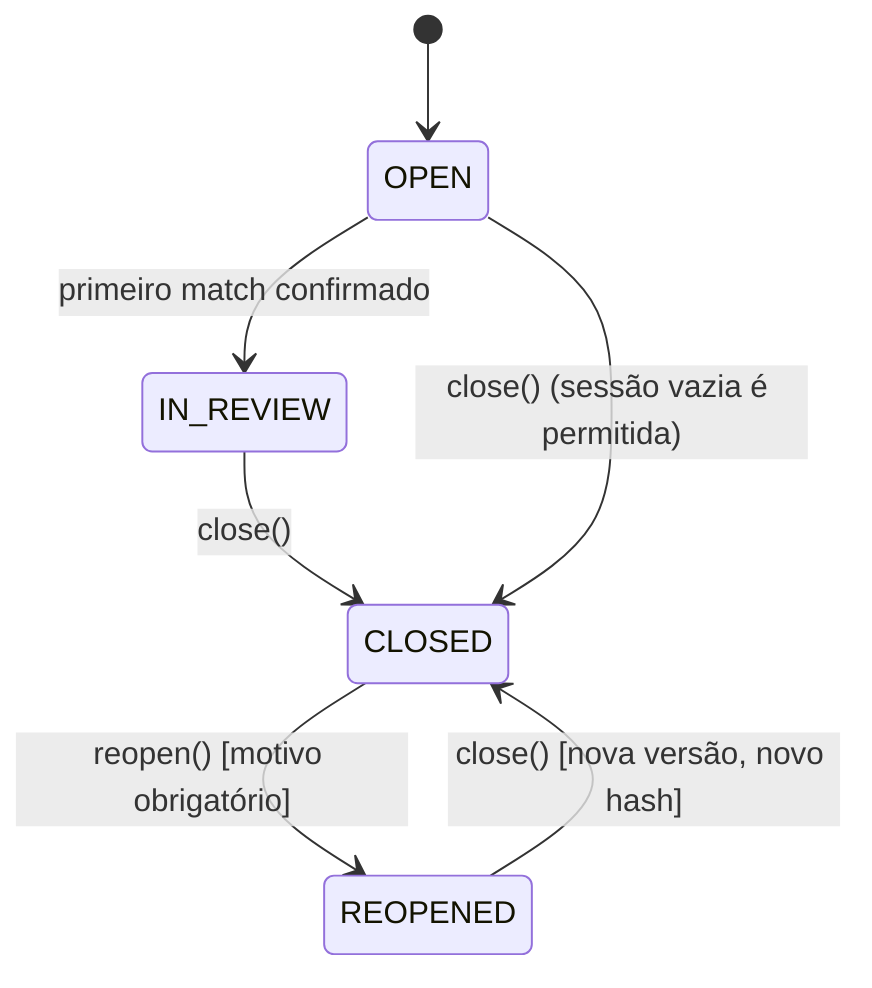

# Implementação — Fase 6: fechamento e governança

**Data:** 14/08/2026
**Escopo:** somente `gestao-modern`
**Estado:** implementado e testado localmente (SQLite); flags desligadas por padrão; nenhuma migration aplicada em banco real; **homologação MariaDB pendente**.

## Contexto da decisão de gating

A última homologação MariaDB (Fase 5.5C, `PACOTE_CONTINUACAO_FASE_5_5C_NO_GO.md`) terminou em NO-GO por ausência de infraestrutura descartável (Docker/Podman/MariaDB local), não por bug de código, e concluiu "NÃO INICIAR A FASE 6". A instrução recebida para esta implementação alterou explicitamente essa postura: **desenvolvimento** da Fase 6 autorizado a prosseguir sem aguardar o GO de homologação; **produção** continua bloqueada; homologação MariaDB continua pendência obrigatória antes de produção. Ver `ANALISE_PRE_IMPLEMENTACAO_FASE_6.md` §1 para o registro completo.

## Resumo executivo

Uma sessão conciliada (`reconciliation_sessions`, Fase 4) agora pode ser transformada em um fechamento histórico reproduzível e auditável (`reconciliation_closures`). O fechamento usa um modelo híbrido: referência (FK) + cópia mínima imutável dos campos que definem o resultado financeiro + um snapshot canônico consolidado, sobre o qual um hash SHA-256 é calculado. Reabertura é sempre excepcional, exige motivo, nunca apaga o fechamento anterior — gera uma nova linha encadeada por `previous_closure_id`.



## Componentes novos

- `ReconciliationClosureValidator`: calcula `blockers`/`warnings` sob demanda (`READY_TO_CLOSE` nunca persistido);
- `ReconciliationClosureSnapshotBuilder`: monta o payload canônico + métricas calculáveis;
- `ReconciliationClosureHashService`: canonicalização (chaves ordenadas, listas ordenadas pela própria representação) + SHA-256;
- `ReconciliationClosureService::close()`: orquestra validação + snapshot + hash + persistência numa única transação com locks ordenados;
- `ReconciliationReopeningService::reopen()`: reabertura excepcional auditada;
- trait `AssertsReconciliationSessionOpenForWrite`: usada por `ManualReconciliationService`, `ReconciliationCandidateService`, `ReconciliationExceptionService`, `ReconciliationMatchingEngine` para bloquear mutações quando a sessão está `CLOSED`;
- middleware `EnsureReconciliationClosingEnabled` (`reconciliation.closing`);
- `ReconciliationClosureController` + 2 form requests;
- 5 telas em `resources/views/reconciliation-v2/` (seção de fechamento em `show.blade.php` + `closure/create`, `closure/history`, `closure/show`).

## Tabelas novas

### `reconciliation_closures` — migration `2026_08_14_000010`

PK `id`; FK `reconciliation_session_id` (RESTRICT); cópia denormalizada de `account_id`/`period_start`/`period_end`; `sequence_number`; `status` (`CLOSED`/`REOPENED`); `schema_version`, `engine_version`; `closure_hash` (CHAR 64) + `hash_algorithm`; `snapshot_payload` (LONGTEXT); auto-FK `previous_closure_id`; `closed_by`/`closed_at`; `reopened_by`/`reopened_at`; `correlation_id`. Unique `(session, sequence_number)`; índices por conta/período e por sessão/status.

### `reconciliation_closure_matches` — migration `2026_08_14_000020`

PK `id`; FKs para closure (RESTRICT) e match (RESTRICT); `captured_status`, `captured_total_amount` DECIMAL(15,2). Unique por `(closure, match)`.

### `reconciliation_closure_exceptions` — migration `2026_08_14_000030`

PK `id`; FKs para closure (RESTRICT) e exception (RESTRICT); `captured_status`, `captured_type`. Unique por `(closure, exception)`.

### `reconciliation_closure_metrics` — migration `2026_08_14_000040`

Modelo chave/valor: PK `id`; FK para closure (RESTRICT); `metric_key`, `metric_value` DECIMAL(20,4), `metric_value_text`. Unique por `(closure, metric_key)`.

### `reconciliation_reopenings` — migration `2026_08_14_000050`

PK `id`; FK para closure (RESTRICT); `reopened_by`/`reopened_at`; `reason` (nunca nullable); `previous_status`; `resulting_session_status`; `correlation_id`.

Nenhuma migration anterior foi reescrita. `ReconciliationSessionStatus` foi estendido com `Closed`/`Reopened` (a coluna já era `string(20)`, sem migration de schema).

## Métricas calculadas

`bank_transactions_count`, `credit_total`, `debit_total`, `titles_count`, `reconciled_amount`, `unreconciled_amount`, `matches_manual_count`, `matches_assisted_count`, `exceptions_justified_count`, `exceptions_open_count`. `reconciliation_rate` e saldo inicial/final **não são calculados** — fórmula/autoridade de saldo dependem de decisão de negócio ainda pendente (ver ADR-015).

## Política de divergências: Governada

Único comportamento implementado. `CLOSURE_OPEN_EXCEPTIONS` bloqueia com exceções `OPEN`/`IN_REVIEW`; `JUSTIFIED`/`RESOLVED` não bloqueiam. Política Extraordinária (fechar com exceção aberta) não foi implementada — ver ADR-015.

## Feature flags e rotas

`RECONCILIATION_CLOSING_ENABLED=false` por padrão, depende de `RECONCILIATION_V2_ENABLED=true`, independente de `RECONCILIATION_MATCHING_ENABLED`. Foram adicionadas 5 rotas web autenticadas: preparar fechamento, confirmar fechamento, histórico, detalhe, reabrir. A v2 totaliza **18 rotas** (13 das Fases 4/5 + 5 novas); `/api/v1` continua com 13 operações, sem exposição de fechamento na API.

## RBAC

4 gates novos: `reconciliation:close`, `reconciliation:reopen`, `reconciliation:export` (inclui quem tem `close`), `reconciliation:admin` (sem efeito funcional nesta fase). Mesmo padrão de allowlist por `config()`/`env()` já usado por `reconciliation:view`/`manage` — nenhuma tabela de papéis foi criada.

## Proteções e side effects

### PROTEÇÃO DO CONTAS A PAGAR E CONTAS A RECEBER

| Local | Acessado? | Modificado? |
|---|---|---|
| `G:\xampp\htdocs\contas` | NÃO | NÃO |
| `G:\xampp\htdocs\contasareceber` | NÃO | NÃO |

### Proteção do legado

- `avt_lancamentos` alterada? **NÃO**
- `avt_recebimentos` alterada? **NÃO**
- `avt_movimentos` alterada? **NÃO**
- `avt_conciliacoes` alterada? **NÃO**
- `/conciliacoes` (legado) alterado? **NÃO**

### Efeitos financeiros

- `close()`/`reopen()` criaram `title_settlement`? **NÃO**
- `close()`/`reopen()` alteraram `financial_titles`/`bank_transactions`? **NÃO**
- valores financeiros originais alterados? **NÃO**

## Testes

**ANTES:** 93 testes, 565 asserções.
**DEPOIS:** 111 testes, 652 asserções.

Cobertura dedicada (`tests/Feature/ReconciliationClosureTest.php`, 18 testes): feature flags (matriz de dependência), permissões de fechar/reabrir, fechamento normal com snapshot/hash/métricas/auditoria, double-close, divergência aberta bloqueando e justificada liberando, sobreposição de período (bloqueando `CLOSED` e permitindo contra `REOPENED`), determinismo/insensibilidade a ordem/sensibilidade a conteúdo do hash, reabertura completa (com/sem motivo, de fechamento não-`CLOSED`), ciclo de reclose com sequência e encadeamento, bloqueio de match/void/aceite/rejeição/geração após fechamento, ausência de efeito financeiro/legado, migrations sem tocar tabelas protegidas, fluxo web completo (preparar → confirmar → histórico → detalhe → reabrir).

## Homologação

- MariaDB 10.1 homologado? **NÃO**
- concorrência real (`close()`/`reopen()` em processos independentes) validada? **NÃO**
- migrations aplicadas em banco real? **NÃO**

```text
DESENVOLVIMENTO FASE 6: CONCLUÍDO
HOMOLOGAÇÃO MARIADB: PENDENTE
PRODUÇÃO: NÃO AUTORIZADA
```

## Arquivos da Fase 6

- migrations `2026_08_14_000010`–`2026_08_14_000050`;
- `app/Domain/Reconciliation/Enums/ReconciliationSessionStatus.php` (estendido), `app/Domain/Reconciliation/Closure/` (enum + value object);
- `app/Application/Reconciliation/ReconciliationClosingFeature.php`, `ReconciliationClosureValidator.php`, `ReconciliationClosureSnapshotBuilder.php`, `ReconciliationClosureHashService.php`, `ReconciliationClosureService.php`, `ReconciliationReopeningService.php`, `AssertsReconciliationSessionOpenForWrite.php`;
- `app/Models/ReconciliationClosure.php`, `ReconciliationClosureMatch.php`, `ReconciliationClosureException.php`, `ReconciliationClosureMetric.php`, `ReconciliationReopening.php`;
- `app/Http/Middleware/EnsureReconciliationClosingEnabled.php`, `app/Http/Controllers/ReconciliationClosureController.php`, `app/Http/Requests/StoreReconciliationClosureRequest.php`, `ReopenReconciliationClosureRequest.php`;
- `config/reconciliation.php` (chaves novas), `.env.example`, `bootstrap/app.php`, `routes/web.php`, `app/Providers/AppServiceProvider.php` (gates novos);
- alterações pontuais em `ManualReconciliationService.php`, `ReconciliationCandidateService.php`, `ReconciliationExceptionService.php`, `ReconciliationMatchingEngine.php` (bloqueio pós-fechamento);
- views `reconciliation-v2/show.blade.php` (seção nova) e `reconciliation-v2/closure/{create,history,show}.blade.php`;
- `tests/Feature/ReconciliationClosureTest.php`, ajuste de contrato de rotas em `ReconciliationV2Test.php`;
- ADR-013, ADR-014, ADR-015, `docs/operations/PHASE-6-CLOSING-RUNBOOK.md`, `ANALISE_PRE_IMPLEMENTACAO_FASE_6.md`, este relatório.

## Limitações e pendências de negócio

14 perguntas em `docs/phase-6-design/FASE_6_PERGUNTAS_NEGOCIO.md` seguem sem resposta formal do financeiro (política de divergência oficial, segregação ator-fecha≠ator-reabre, saldo de autoridade, four-eyes, prazo de fechamento, janela de reabertura, formato de exportação). Esta implementação usa exclusivamente os defaults seguros documentados em ADR-015. Nenhuma dessas respostas foi inventada. Exportação de relatório de fechamento não foi implementada (gate `reconciliation:export` preparado, sem endpoint). Concorrência real InnoDB/MariaDB permanece não comprovada.
