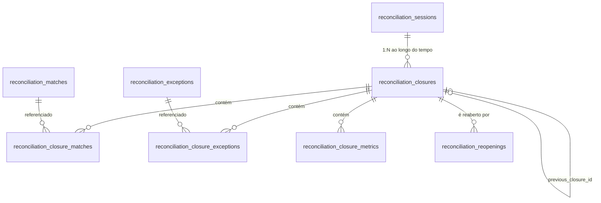

# Fase 6 — Modelo de dados proposto

- Status: **proposta, não implementada**. Nenhuma migration real foi criada.
- Compatibilidade obrigatória: MariaDB 10.1.x (sem tipo `JSON` nativo, sem índice único parcial/condicional, suporte limitado a `CHECK`).
- Convenções seguidas: as mesmas das migrations de `database/migrations/2026_08_13_0001[3-9]0_*` e `...000200_*` (engine `InnoDB`, nomes de constraint explícitos e curtos, `restrictOnDelete()` como padrão, sem FK contra tabelas legadas/`avt_*`, valores monetários em `decimal(15,2)`, evidência em `longText`, hash em `char(64)` + versão em `string`).

Este documento é especificação de migrations futuras — não deve ser confundido com migrations reais. Nenhum arquivo em `database/migrations/` foi criado ou alterado.

---

## 1. Extensão de enum existente (sem migration de schema)

`reconciliation_sessions.status` já é `string(20)`. Não é necessário alterar a coluna — apenas estender o enum de domínio:

```php
// app/Domain/Reconciliation/Enums/ReconciliationSessionStatus.php
enum ReconciliationSessionStatus: string
{
    case Open = 'OPEN';
    case InReview = 'IN_REVIEW';
    case Closed = 'CLOSED';       // novo
    case Reopened = 'REOPENED';   // novo
}
```

Justificativa detalhada em `FASE_6_STATE_MACHINE.md`. `READY_TO_CLOSE` **não** vira valor de coluna — é computado em tempo real por `ReconciliationClosureValidator` e nunca persistido (evita estado redundante que poderia divergir do estado real).

---

## 2. Tabela `reconciliation_closures`

Um fechamento por conta/período. Uma sessão pode ter mais de uma linha ao longo do tempo (fechar → reabrir → fechar de novo).

| Coluna | Tipo | Nullable | Default | Observação |
|---|---|---|---|---|
| `id` | `bigint unsigned` (PK) | não | — | `$table->id()` |
| `reconciliation_session_id` | `bigint unsigned` | não | — | FK → `reconciliation_sessions.id` |
| `account_id` | `int unsigned` | não | — | cópia denormalizada de `reconciliation_sessions.account_id` no momento do fechamento; sem FK (mesmo padrão de `reconciliation_sessions.account_id`, conta é legada) |
| `period_start` | `date` | não | — | cópia denormalizada, imutável |
| `period_end` | `date` | não | — | cópia denormalizada, imutável |
| `sequence_number` | `smallint unsigned` | não | — | 1 no primeiro fechamento da sessão, incrementa a cada reclose |
| `status` | `string(16)` | não | `'CLOSED'` | `CLOSED` \| `REOPENED` (enum de domínio próprio, ver §9 da arquitetura) |
| `schema_version` | `string(20)` | não | — | versão do formato do snapshot, ex. `closure-snapshot-v1` |
| `engine_version` | `string(40)` | não | — | cópia do `engine_version` de matching vigente no fechamento (mesmo campo usado em `reconciliation_candidates`/`reconciliation_exceptions`) |
| `closure_hash` | `char(64)` | não | — | SHA-256 hex do snapshot canonizado (§4 da arquitetura) |
| `hash_algorithm` | `string(20)` | não | `'sha256'` | permite trocar algoritmo no futuro sem quebrar linhas antigas |
| `snapshot_payload` | `longText` | não | — | JSON canonizado (mesmo padrão de `reconciliation_exceptions.evidence`) |
| `previous_closure_id` | `bigint unsigned` | sim | `null` | auto-FK → `reconciliation_closures.id`; aponta para o fechamento que este substitui após reabertura |
| `closed_by` | `bigint unsigned` | não | — | ator que fechou |
| `closed_at` | `timestamp` | não | — | |
| `reopened_by` | `bigint unsigned` | sim | `null` | cópia de conveniência do último `reconciliation_reopenings.reopened_by` (detalhe completo mora na tabela de reaberturas) |
| `reopened_at` | `timestamp` | sim | `null` | |
| `correlation_id` | `uuid` | não | — | mesmo tipo usado em `reconciliation_candidates`/`reconciliation_exceptions` |
| `created_at` / `updated_at` | `timestamp` | — | — | `$table->timestamps()` — mas ver §6 da arquitetura: content-bearing columns nunca sofrem `UPDATE` após criação; apenas `status`/`reopened_by`/`reopened_at` mudam, e só uma vez (fechar→reabrir) |

**Constraints:**

```php
$table->foreign('reconciliation_session_id', 'recon_closures_session_fk')
    ->references('id')->on('reconciliation_sessions')->restrictOnDelete();
$table->foreign('previous_closure_id', 'recon_closures_previous_fk')
    ->references('id')->on('reconciliation_closures')->restrictOnDelete();

$table->unique(['reconciliation_session_id', 'sequence_number'], 'recon_closures_session_seq_uq');
$table->index(['account_id', 'period_start', 'period_end'], 'recon_closures_account_period_idx');
$table->index(['reconciliation_session_id', 'status'], 'recon_closures_session_status_idx');
$table->index('correlation_id', 'recon_closures_correlation_idx');
```

Não existe unicidade de banco para "no máximo um fechamento `CLOSED` ativo por sessão" — MariaDB 10.1 não tem índice único condicional. Essa regra é aplicada em transação de aplicação com `lockForUpdate()`, exatamente como a Fase 4 já faz para disponibilidade de alocação (ADR-009, seção "Integridade e compatibilidade").

---

## 3. Tabela `reconciliation_closure_matches`

Linha de junção com cópia mínima do resultado financeiro no momento do fechamento (Opção C híbrida — ver arquitetura §3).

| Coluna | Tipo | Nullable | Observação |
|---|---|---|---|
| `id` | `bigint unsigned` (PK) | não | |
| `reconciliation_closure_id` | `bigint unsigned` | não | FK → `reconciliation_closures.id` |
| `reconciliation_match_id` | `bigint unsigned` | não | FK → `reconciliation_matches.id` |
| `captured_status` | `string(20)` | não | valor de `ReconciliationMatchStatus` no momento do fechamento |
| `captured_total_amount` | `decimal(15,2)` | não | soma das alocações do match no momento do fechamento |
| `created_at` / `updated_at` | `timestamp` | — | |

```php
$table->foreign('reconciliation_closure_id', 'recon_closure_matches_closure_fk')
    ->references('id')->on('reconciliation_closures')->restrictOnDelete();
$table->foreign('reconciliation_match_id', 'recon_closure_matches_match_fk')
    ->references('id')->on('reconciliation_matches')->restrictOnDelete();
$table->unique(['reconciliation_closure_id', 'reconciliation_match_id'], 'recon_closure_matches_uq');
$table->index('reconciliation_match_id', 'recon_closure_matches_match_idx');
```

## 4. Tabela `reconciliation_closure_exceptions`

| Coluna | Tipo | Nullable | Observação |
|---|---|---|---|
| `id` | `bigint unsigned` (PK) | não | |
| `reconciliation_closure_id` | `bigint unsigned` | não | FK → `reconciliation_closures.id` |
| `reconciliation_exception_id` | `bigint unsigned` | não | FK → `reconciliation_exceptions.id` |
| `captured_status` | `string(16)` | não | valor de `ReconciliationExceptionStatus` no momento do fechamento |
| `captured_type` | `string(48)` | não | valor de `ReconciliationExceptionType` |
| `created_at` / `updated_at` | `timestamp` | — | |

```php
$table->foreign('reconciliation_closure_id', 'recon_closure_exceptions_closure_fk')
    ->references('id')->on('reconciliation_closures')->restrictOnDelete();
$table->foreign('reconciliation_exception_id', 'recon_closure_exceptions_exception_fk')
    ->references('id')->on('reconciliation_exceptions')->restrictOnDelete();
$table->unique(['reconciliation_closure_id', 'reconciliation_exception_id'], 'recon_closure_exceptions_uq');
$table->index('reconciliation_exception_id', 'recon_closure_exceptions_exception_idx');
```

## 5. Tabela `reconciliation_closure_metrics`

Modelo chave/valor (EAV mínimo) em vez de colunas fixas: as métricas exatas exigidas pelo negócio ainda não estão definidas (ver `FASE_6_PERGUNTAS_NEGOCIO.md` e §19). Uma tabela de colunas fixas exigiria nova migration a cada métrica nova; a tabela chave/valor permite adicionar métricas sem alterar schema, mantendo auditabilidade (cada métrica é uma linha imutável, parte do hash).

| Coluna | Tipo | Nullable | Observação |
|---|---|---|---|
| `id` | `bigint unsigned` (PK) | não | |
| `reconciliation_closure_id` | `bigint unsigned` | não | FK → `reconciliation_closures.id` |
| `metric_key` | `string(60)` | não | ex.: `bank_transactions_count`, `credit_total`, `debit_total`, `titles_count`, `reconciled_amount`, `unreconciled_amount`, `exceptions_justified_count`, `exceptions_open_count`, `reconciliation_rate` |
| `metric_value` | `decimal(20,4)` | sim | valor numérico (contagens e somas monetárias) |
| `metric_value_text` | `string(191)` | sim | usado apenas quando o valor não é numérico puro (ex.: código de moeda) |
| `created_at` / `updated_at` | `timestamp` | — | |

```php
$table->foreign('reconciliation_closure_id', 'recon_closure_metrics_closure_fk')
    ->references('id')->on('reconciliation_closures')->restrictOnDelete();
$table->unique(['reconciliation_closure_id', 'metric_key'], 'recon_closure_metrics_uq');
```

Lista completa de métricas candidatas e quais dependem de regra de negócio: ver §19 no `FASE_6_IMPLEMENTATION_PLAN.md` e `FASE_6_PERGUNTAS_NEGOCIO.md`.

## 6. Tabela `reconciliation_reopenings`

| Coluna | Tipo | Nullable | Observação |
|---|---|---|---|
| `id` | `bigint unsigned` (PK) | não | |
| `reconciliation_closure_id` | `bigint unsigned` | não | FK → `reconciliation_closures.id` (o fechamento reaberto) |
| `reopened_by` | `bigint unsigned` | não | ator com permissão elevada (ver `FASE_6_RBAC.md`) |
| `reopened_at` | `timestamp` | não | |
| `reason` | `text` | não | obrigatório, sem default — mesmo padrão de `reconciliation_matches.void_reason`, mas aqui **nunca nullable** |
| `previous_status` | `string(16)` | não | status do fechamento antes da reabertura (deve ser sempre `CLOSED`) |
| `resulting_session_status` | `string(20)` | não | status atribuído à sessão após a reabertura (`REOPENED`) |
| `correlation_id` | `uuid` | não | |
| `created_at` / `updated_at` | `timestamp` | — | |

```php
$table->foreign('reconciliation_closure_id', 'recon_reopenings_closure_fk')
    ->references('id')->on('reconciliation_closures')->restrictOnDelete();
$table->index(['reconciliation_closure_id', 'reopened_at'], 'recon_reopenings_closure_date_idx');
$table->index('correlation_id', 'recon_reopenings_correlation_idx');
```

Não há `unique` impedindo múltiplas reaberturas do mesmo fechamento ao longo do tempo — isso é esperado (um fechamento pode, em tese, ser reaberto mais de uma vez se cada reabertura gerar um novo fechamento e o ciclo se repetir; cada linha aqui é um evento imutável).

---

## 7. Cadeia de histórico (exemplo)

```text
reconciliation_sessions#42 (account_id=7, período 01/08–31/08)

reconciliation_closures#101  sequence=1 status=CLOSED   previous_closure_id=NULL
        ↓ reconciliation_reopenings#1 (reason="ajuste solicitado pelo financeiro")
reconciliation_closures#101  status=REOPENED (mesma linha, apenas status/reopened_* atualizados)
        ↓ (novos matches/voids acontecem na sessão#42, agora em status REOPENED)
reconciliation_closures#205  sequence=2 status=CLOSED   previous_closure_id=101
```

`reconciliation_closures#101` nunca é apagada nem tem `snapshot_payload`/`closure_hash` reescritos — ela documenta exatamente o que existia no primeiro fechamento. `#205` é uma linha nova e independente, com seu próprio hash.

## 8. Diagrama de relacionamento



## 9. Ordem sugerida das migrations (numeração a definir no momento da implementação)

```text
1) alterar app/Domain/Reconciliation/Enums/ReconciliationSessionStatus.php (não é migration)
2) create_reconciliation_closures_table
3) create_reconciliation_closure_matches_table
4) create_reconciliation_closure_exceptions_table
5) create_reconciliation_closure_metrics_table
6) create_reconciliation_reopenings_table
```

Cada migration deve ter `down()` completo (`Schema::dropIfExists`), seguindo o padrão de todas as migrations existentes — sem exceção, para permitir o ciclo UP → DOWN → UP exigido pelo runbook de homologação.
