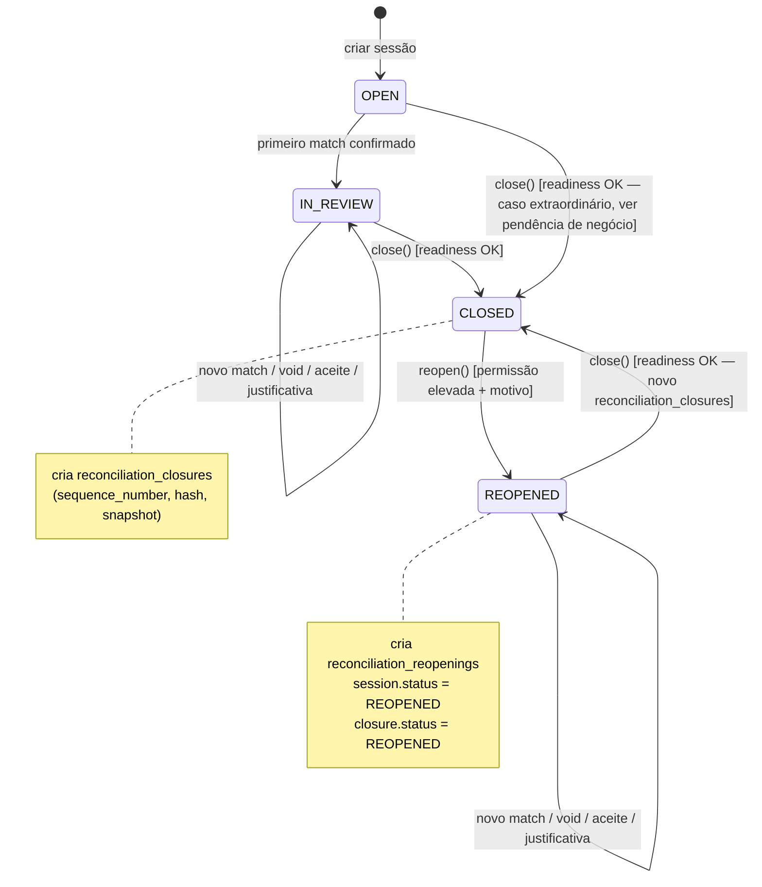

# Fase 6 — Máquina de estados, critérios de fechamento e concorrência

- Status: **proposta, não implementada**

---

## 1. Estados avaliados

| Estado | Persistido? | Onde | Significado |
|---|---|---|---|
| `OPEN` | sim | `reconciliation_sessions.status` (já existe) | sessão criada, nenhum match confirmado ainda |
| `IN_REVIEW` | sim | `reconciliation_sessions.status` (já existe) | ao menos um match confirmado; conciliação em andamento |
| `READY_TO_CLOSE` | **não** | computado por `ReconciliationClosureValidator` | todos os critérios técnicos de fechamento passam agora; puramente informativo para a tela de pré-fechamento |
| `CLOSED` | sim | `reconciliation_sessions.status` **e** `reconciliation_closures.status` (novo) | existe um fechamento vigente para a sessão |
| `REOPENED` | sim | `reconciliation_sessions.status` **e** `reconciliation_closures.status` (novo) | o fechamento vigente foi reaberto; a sessão volta a aceitar match/void/aceite/justificativa até um novo fechamento |

### Por que `READY_TO_CLOSE` não é persistido

É inteiramente derivável a partir do estado atual de matches/exceptions da sessão. Persisti-lo criaria um segundo lugar de verdade que poderia divergir do resultado real do validador (por exemplo, se uma exceção for justificada depois de a sessão ser marcada `READY_TO_CLOSE`, mas antes do fechamento efetivo). Calculá-lo sob demanda elimina essa classe inteira de bug, ao custo de uma consulta — aceitável, pois só roda na tela de pré-fechamento e no próprio `close()`.

### Por que `REOPENED` é persistido e não apenas um evento

`REOPENED` poderia ser modelado como "a sessão volta para `IN_REVIEW`", tratando a reabertura como um evento sem estado próprio. Optou-se por um estado distinto porque ele tem valor de auditoria genuíno: permite responder "quais sessões já foram fechadas e reabertas ao menos uma vez" sem percorrer `reconciliation_reopenings` para cada consulta, e evita reaproveitar `IN_REVIEW` para dois significados diferentes ("nunca fechou" vs. "já fechou e foi corrigido"). Operacionalmente, `REOPENED` permite exatamente as mesmas ações que `IN_REVIEW` (ver §4).

## 2. Diagrama de transições



`READY_TO_CLOSE` não aparece como nó porque não é um estado da sessão — é uma resposta booleana (`ready: bool`) sobreposta a `OPEN`/`IN_REVIEW`/`REOPENED`, calculada sob demanda.

## 3. Critérios para fechar — técnica vs. negócio

`ReconciliationClosureValidator` produz uma lista de `blockers` (impedem o fechamento sempre) e `warnings` (dependem de política configurável). A distinção é deliberada: **nenhuma regra de negócio ainda validada pelo financeiro vira `blocker` fixo no código** — apenas regras estruturais que, se ignoradas, quebrariam a integridade do modelo já aceito nas Fases 1–5.

### Regra técnica (blocker sempre — já decidível agora)

| Código | Condição | Por que é técnica e não de negócio |
|---|---|---|
| `CLOSURE_SESSION_NOT_FOUND` | sessão não existe | integridade referencial básica |
| `CLOSURE_SESSION_ALREADY_CLOSED` | sessão já está `CLOSED` (sem reabertura) | evita fechamento duplicado do mesmo estado |
| `CLOSURE_INVALID_MATCH_STATE` | algum match incluído tem alocação com soma diferente da esperada | a Fase 4 já garante isso na confirmação; é apenas uma revalidação defensiva antes de assinar o hash |
| `CLOSURE_PERIOD_OVERLAP` | já existe outro fechamento `CLOSED` da mesma conta com período sobreposto (§5) | protege a unicidade lógica de "qual fechamento é autoridade para esta data" |
| `CLOSURE_CONCURRENT_OPERATION` | há um match/void/aceite/justificativa em voo na mesma sessão (lock ocupado) | concorrência, não política |

### Regra de negócio a validar (warning por padrão — ver `FASE_6_PERGUNTAS_NEGOCIO.md`)

| Código | Condição | Pendência |
|---|---|---|
| `CLOSURE_OPEN_EXCEPTIONS` | existem `reconciliation_exceptions` com `status = OPEN` na sessão | política rígida vs. governada vs. extraordinária — §4 abaixo |
| `CLOSURE_PENDING_CANDIDATES` | existem `reconciliation_candidates` com `status = PENDING` não decididos | o negócio ainda não definiu se candidato pendente deve bloquear fechamento |
| `CLOSURE_EMPTY_SESSION` | sessão em `OPEN` sem nenhum match, sendo fechada | pode ser legítimo ("mês sem movimento") ou sintoma de erro operacional |
| `CLOSURE_UNRECONCILED_BALANCE` | existe saldo bancário não conciliado acima de uma tolerância | tolerância e existência de "saldo bancário" no domínio moderno ainda são pendências (ver §20 na arquitetura / perguntas de negócio) |

Nenhum destes vira `blocker` até que o financeiro responda `FASE_6_PERGUNTAS_NEGOCIO.md`. Até lá, o comportamento default proposto é **política governada** (§4) — a mais segura das três sem travar operação legítima.

## 4. Política de divergências abertas — três alternativas

### Rígida
Nenhuma `reconciliation_exceptions` com `status = OPEN` pode existir na sessão para fechar. Mais segura, mais restritiva; pode travar fechamentos por divergências triviais nunca revisadas.

### Governada (recomendada como default seguro)
Fechamento é permitido com exceções `JUSTIFIED` (alguém já registrou ator + motivo — a Fase 5 já exige isso, ADR-012), mas **bloqueia** com exceções `OPEN` ou `IN_REVIEW`. Reaproveita 100% do fluxo humano que já existe (`ReconciliationExceptionService::justify`, já implementado) sem inventar um novo tipo de aprovação.

### Extraordinária
Permite fechar com exceção `OPEN`, mediante permissão elevada extra (além de `reconciliation:close`) e motivo obrigatório registrado junto ao fechamento. Útil para fechamentos forçados por prazo regulatório, mas cria um caminho para "esconder" divergência sem investigação — maior risco.

**Recomendação:** Governada como comportamento padrão do validador; Extraordinária como *feature flag adicional* (`RECONCILIATION_CLOSURE_FORCE_ENABLED=false` por padrão) para uso emergencial, nunca ligada por padrão. Rígida fica disponível como configuração mais restritiva para quem preferir. A escolha final entre as três precisa de validação do financeiro — ver `FASE_6_PERGUNTAS_NEGOCIO.md`.

## 5. Sobreposição de período

Duas sessões da mesma conta podem hoje coexistir com períodos sobrepostos (`reconciliation_sessions` só impede duplicata exata de `(account_id, period_start, period_end)`, não sobreposição). Isso é aceitável enquanto nada é fechado — mas dois **fechamentos `CLOSED`** simultâneos com sobreposição, da mesma conta, quebrariam a pergunta "qual fechamento é autoridade para o dia 15/08?".

**Estratégia técnica:** no momento do `close()`, dentro da mesma transação que trava a sessão (`lockForUpdate`), consultar:

```php
ReconciliationClosure::query()
    ->where('account_id', $accountId)
    ->where('status', ReconciliationClosureStatus::Closed)
    ->where('period_start', '<=', $periodEnd)
    ->where('period_end', '>=', $periodStart)
    ->where('reconciliation_session_id', '!=', $sessionId)
    ->lockForUpdate()
    ->exists();
```

Se existir, `CLOSURE_PERIOD_OVERLAP` bloqueia o fechamento. Não há índice único de banco capaz de expressar "sem sobreposição de intervalo" em MariaDB 10.1 sem `CHECK` de range (não suportado) — por isso a checagem é transacional em aplicação, com `lockForUpdate` ordenado por `account_id` para serializar tentativas concorrentes de fechar períodos sobrepostos da mesma conta.

## 6. Bloqueio de ações após o fechamento

| Ação | Bloqueada quando sessão está `CLOSED`? | Onde a proteção deve existir |
|---|---|---|
| Criar novo match (`ManualReconciliationService::confirm`) | **sim** | `ManualReconciliationService` — adicionar checagem de `session->status` logo após `assertActor`, antes de qualquer lock; **nunca depender só da UI/rota** |
| Void de match (`ManualReconciliationService::void`) | **sim** | idem — mesmo método, mesma checagem |
| Aceitar candidato (`ReconciliationCandidateService::accept`) | **sim** | `ReconciliationCandidateService` |
| Rejeitar candidato (`ReconciliationCandidateService::reject`) | **sim** — rejeitar também é uma decisão que altera o que "pertencia" ao fechamento | idem |
| Justificar exceção (`ReconciliationExceptionService::justify`) | **sim** | `ReconciliationExceptionService` |
| Gerar novos candidatos (`ReconciliationMatchingEngine::generate`) | **sim** | `ReconciliationMatchingEngine` — gerar candidato para sessão fechada não tem sentido operacional |
| Alterar sessão (não existe hoje `update` de sessão; se vier a existir) | **sim** | onde quer que seja implementado |
| Consultar/visualizar (`show`, listas, exportar) | **não** — sessões fechadas continuam totalmente visíveis | sem alteração |

### Onde a proteção deve existir (camadas)

1. **Domain/Application (obrigatório, fonte de verdade):** cada serviço acima recebe uma checagem `assertSessionOpenForWrite(ReconciliationSession $session)` (novo método utilitário, ou repetição do padrão já usado por `assertActor`) que lança `ReconciliationRuleViolation('RECONCILIATION_SESSION_CLOSED', ...)` se `status` for `CLOSED`. Esta é a única camada que **não pode ser pulada** — replica exatamente a filosofia já documentada em ADR-009 ("a concorrência ainda precisa de... a aplicação valida").
2. **UI:** botões de ação desabilitados/ocultos quando a sessão está fechada, com mensagem explicativa — evita frustração do usuário, mas não é a proteção real.
3. **Banco de dados:** MariaDB 10.1 não oferece trigger declarativo simples e portátil o suficiente para justificar o custo aqui, dado que todas as escritas já passam por `DB::transaction` com `lockForUpdate` na aplicação (mesmo racional de ADR-009 para disponibilidade). Não é necessário nem recomendado adicionar trigger de banco nesta fase.

A regra geral do projeto — "nunca depender apenas da tela" — está satisfeita pela camada 1.

## 7. Reabertura

`reopen()` é modelada como uma operação excepcional, nunca uma correção silenciosa:

- exige permissão elevada (`reconciliation:reopen`, distinta de `reconciliation:close` — ver `FASE_6_RBAC.md`);
- exige `reason` não vazio (1–1000 caracteres, mesma validação já usada em `void_reason`, mas aqui **sem permitir null**);
- registra ator, timestamp, `correlation_id` e o `status` anterior do fechamento (`previous_status`, deve ser sempre `CLOSED` — reabrir algo já `REOPENED` sem um fechamento novo no meio é um erro de estado, vira `blocker` técnico `CLOSURE_NOT_CLOSED`);
- **não apaga** `reconciliation_closures` — apenas atualiza `status`, `reopened_by`, `reopened_at` na linha existente e insere uma linha nova em `reconciliation_reopenings` com o detalhe completo.

## 8. Histórico de reaberturas — comparação de versões

```text
Fechamento #1 (reconciliation_closures#101, sequence=1)
    ↓ Reabertura #1 (reconciliation_reopenings#1, motivo registrado)
Alterações (novos matches/voids na sessão, agora REOPENED)
    ↓
Fechamento #2 (reconciliation_closures#205, sequence=2, previous_closure_id=101)
```

Comparar duas versões é uma consulta de leitura: carregar `snapshot_payload` de `#101` e `#205`, decodificar e diferenciar as listas de `matches[]`/`exceptions[]`/`metrics[]` por ID. Não é necessário nenhum campo adicional além do que já está especificado em `FASE_6_MODELO_DADOS.md` — a comparação é responsabilidade de uma consulta/relatório na camada de apresentação (`FASE_6_UI_UX.md`, tela de Histórico), não do modelo de dados.

## 9. Concorrência e locking

### Registros que precisam de `lockForUpdate` durante `close()`

Na ordem estável já usada pelo restante da base (sessão → recursos relacionados, por ID crescente — ADR-009):

1. `reconciliation_sessions` (a sessão sendo fechada);
2. `reconciliation_matches` da sessão (para capturar `captured_status`/`captured_total_amount` de forma consistente);
3. `reconciliation_exceptions` da sessão (idem);
4. verificação de sobreposição em `reconciliation_closures` de outras sessões da mesma conta (§5).

Tudo dentro de um único `DB::transaction(..., 3)` (mesmo padrão de retry de deadlock já usado em `ManualReconciliationService`/`ReconciliationSessionService`).

### Registros que precisam de `lockForUpdate` durante `reopen()`

1. `reconciliation_closures` (a linha sendo reaberta);
2. `reconciliation_sessions` associada.

### O que `close()`/`reopen()` precisa impedir enquanto está em voo

- `close()` não pode correr concorrentemente com `confirm()`/`void()`/`accept()`/`reject()`/`justify()` na mesma sessão — resolvido pelo mesmo `lockForUpdate` em `reconciliation_sessions` que esses serviços já adquirem primeiro (ADR-009). Como todos travam a sessão como primeiro recurso, a serialização já é natural: quem chegar primeiro na transação vence, o outro espera e revalida.
- Dois `close()` simultâneos na mesma sessão: o segundo, ao tentar `lockForUpdate` a sessão já `CLOSED` pelo primeiro (após o primeiro commitar), encontra `status = CLOSED` e falha com `CLOSURE_SESSION_ALREADY_CLOSED` — não é um deadlock, é uma checagem pós-lock, igual ao padrão já usado para `RECONCILIATION_MATCH_ALREADY_VOIDED`.
- Dois `reopen()` simultâneos no mesmo fechamento: o segundo encontra `status = REOPENED` após o lock e falha com `CLOSURE_NOT_CLOSED`.

Cenários completos de teste de concorrência (processos independentes, não chamadas sequenciais — mesmo padrão de `tests/Homologation/MariaDbConcurrencyHomologationTest.php`) estão em `FASE_6_TEST_PLAN.md`.

## 10. Idempotência

`close()` e `reopen()` não usam `Idempotency-Key` HTTP (esse mecanismo hoje só existe na API V1, ADR-005) — a superfície da Fase 6 é a UI web (`/reconciliacao-v2`), como o restante da conciliação manual/matching. A proteção contra duplo submit é a mesma já usada em toda a Fase 4/5:

- o botão de confirmar fechamento (UI) desabilita após o primeiro clique (camada 2, não confiável sozinha);
- a checagem pós-lock de `status` (§9) é a proteção real: um segundo `POST` que chegue depois do primeiro já commitado encontra a sessão `CLOSED`/`REOPENED` e falha de forma explícita, sem duplicar `reconciliation_closures` nem `reconciliation_reopenings`.

Isso é suficiente porque, diferentemente da API V1 (que precisa de idempotência entre requisições de sistemas externos que podem repetir automaticamente), aqui o ator é sempre um humano autenticado clicando um botão — double-submit acidental, não retry automático de rede.
